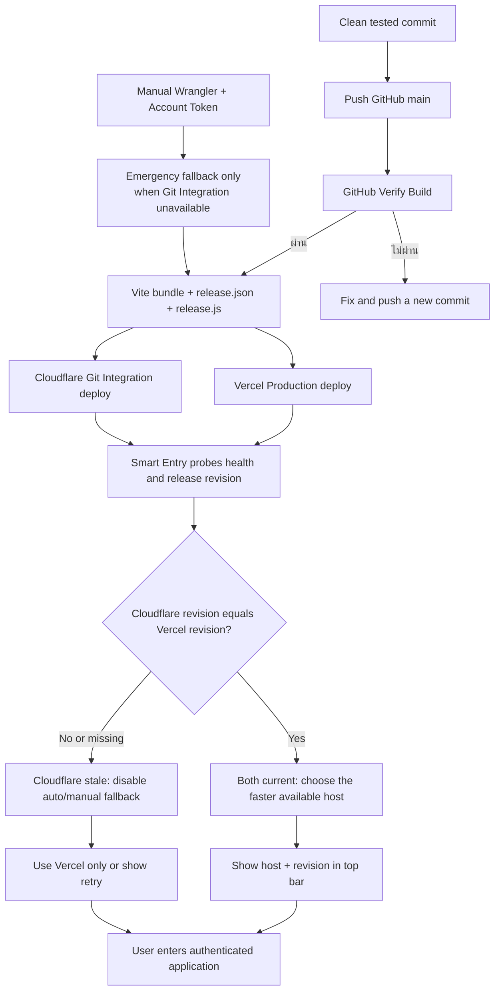

# Release Parity Flow

## Purpose

รักษาให้ Vercel Production เป็นระบบหลักและ Cloudflare Pages เป็นระบบสำรองที่ใช้ได้เฉพาะเมื่อ frontend artifact มาจาก Git revision เดียวกัน ผู้ใช้จึงไม่ถูกพาไปใช้หน้าเก่าแม้ Cloudflare จะตอบเร็วกว่า

## Inputs, outputs and states

- **Inputs:** Git revision, Vite release metadata, `health-check.svg`, `release.js`, deployment result ของ Vercel และ Cloudflare
- **Outputs:** การเลือก host ที่ปลอดภัย, revision ที่ตรวจแล้วใน Smart Entry, ป้าย `Vercel`/`Cloudflare` พร้อม revision บน Top Bar
- **States:** `building`, `deployed`, `probing`, `current`, `stale`, `unknown`, `selected`, `blocked`

## Roles and permissions

- Smart Entry และ release manifest เป็นข้อมูลสาธารณะก่อน Login และไม่มีข้อมูลบริษัท, ผู้ใช้ หรือ token
- Platform Owner เป็นผู้ deploy/reconcile host; ผู้ใช้ทั่วไปเห็นเฉพาะชื่อ host กับ revision ใน Top Bar
- Authentication, route guard และสิทธิ์ข้อมูลยังคงทำงานตามระบบเดิม ไม่มีการขยายสิทธิ์

## Integrations

- Vite สร้าง `release.json` และ `release.js` พร้อม bundle ทุกครั้ง
- Vercel รับ deployment จาก `main`; Cloudflare Pages ต้อง deploy artifact/revision เดียวกัน
- `public/_headers` ป้องกัน Cloudflare cache ของ manifest เพื่อให้ Smart Entry เห็น revision ล่าสุด

## Failure, retry and recovery

- Smart Entry ตรวจ health 3 รอบและอ่าน `release.js` จากทั้งสอง host
- ถ้า Cloudflare ไม่มี Release ID หรือ revision ไม่ตรง Vercel: สถานะ `stale`/`unknown`, ไม่ถูกเลือกอัตโนมัติและปิดลิงก์เลือกเอง
- ถ้า Vercel ตอบได้แต่ Cloudflare stale: ใช้ Vercel เท่านั้น
- ถ้าไม่มี host ที่ผ่านเงื่อนไข: แสดงปุ่มลองใหม่ ไม่ redirect วน และต้องแก้ deployment ก่อนเปิด fallback
- การกู้คืนคือ deploy Cloudflare จาก commit เดียวกับ Vercel แล้วตรวจ `release.json` อีกครั้ง; ไม่ต้องเปลี่ยน database หรือข้อมูลธุรกิจ

## Cloudflare Production release path

- เส้นทางหลักคือ clean release commit → GitHub `main` → GitHub verification → Cloudflare Git Integration; อ่านขั้นตอนเต็มจาก `docs/RELEASE_INCIDENT_PLAYBOOK.md`
- Working tree ต้องสะอาดและ release commit ต้องไม่ตามหลัง GitHub `main`; ถ้า workspace หลักมีงานอื่นค้าง ให้ใช้ clean clone/worktree โดยไม่ reset หรือลบงานเดิม
- ก่อน push ต้องผ่าน targeted tests, lint, typecheck และ build จาก commit เดียวกัน
- หลัง push ต้องตรวจ workflow ของ commit นั้น, remote `release.json` และ authenticated UAT หน้า Module/ปลายทาง/Intake/Audit ที่เปลี่ยน
- `npm run deploy:cloudflare` และ **Account API Token** ที่มี `Pages Write` เป็น emergency fallback เท่านั้นเมื่อ Git Integration ใช้ไม่ได้และได้รับอนุมัติ
- หาก fallback Token ตอบ `401` ให้หยุด retry Token เดิมและรายงาน credential blocker; ถ้า Git Integration ยังปกติให้ใช้เส้นทางหลักต่อ ไม่ถือ local Token เป็น blocker ของ Production
- Token/Environment อยู่ใน GitHub/Cloudflare Secret; ห้ามเขียนลง Git, log, เอกสาร หรือข้อความสนทนา

## Audit and owner

- Smart Entry เก็บผลตรวจเฉพาะใน `sessionStorage`: เวลา, host, latency, revision, parity state และปลายทางที่เลือก
- ไม่มีการส่งข้อมูลส่วนบุคคลหรือ secret ออกไปในการตรวจ
- **Owner:** Platform / Release Management Owner

## Change record

| Version | Date | Rationale | Impact | Migration | Verification | Rollback |
|---|---|---|---|---|---|---|
| v1.0 | 23/8/2569 | แก้ปัญหา Vercel/Cloudflare แสดง frontend คนละรุ่นโดยไม่ชัดเจน | เพิ่ม manifest, parity gate, ป้าย host/revision และ no-cache header ของ Cloudflare | ไม่มี schema/data migration | release/smart-entry tests, lint/build, ตรวจ manifest และ deployment ทั้งสอง host | rollback ทั้งสอง host ไป revision เดียวกัน หรือ revert parity gate ชั่วคราว; ข้อมูลผู้ใช้ไม่ถูกกระทบ |
| v1.1 | 23/8/2569 | ป้องกัน User Token ผ่าน verify แต่ deploy Pages ไม่ได้ และป้องกัน clean worktree build โดยไม่มี `.env` จนหน้าขาว | เพิ่มคำสั่ง deploy กลาง, Account Token/Pages preflight, environment/release/runtime gates | ไม่มี | contract test, lint, typecheck, build และ Cloudflare revision smoke | ใช้ revision ก่อนหน้าที่ผ่าน smoke test หรือ deploy commit เดิมผ่านคำสั่งกลาง; ไม่กระทบฐานข้อมูล |
| v1.2 | 24/8/2569 | ยุติความสับสนที่ทุกห้องพยายามใช้ local Token ซ้ำ ทั้งที่ Production ใช้ Git Integration | กำหนด GitHub main/Git verification/Cloudflare Git Integration เป็นเส้นทางหลัก และ Token เป็น emergency fallback เท่านั้น | ไม่มี | release playbook contract, GitHub workflow, Cloudflare revision และ authenticated runtime smoke | revert เอกสาร/contract และใช้ release revision ก่อนหน้า; ไม่กระทบข้อมูลธุรกิจ |
