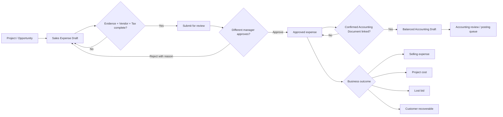

# Sales Expense Accounting Flow

## Purpose

ค่าใช้จ่ายขายและค่าใช้จ่ายก่อนขายต้องแยกจากต้นทุนโครงการจนกว่าจะมีการตัดสินผลลัพธ์ทางธุรกิจ ระบบเก็บยอดฐานก่อน VAT, VAT, ภาษีหัก ณ ที่จ่าย, ผู้ขาย, เอกสารบัญชี และหลักฐานอ้างอิงแยกกัน เพื่อให้ฝ่ายบัญชีตรวจสอบย้อนกลับได้โดยไม่เดาฐานยอดจากข้อมูลเดิม

## Input And Ownership

| Stage | Required input | Owner | Output |
| --- | --- | --- | --- |
| Draft | Project, date, expense category, account category, description, payee/vendor, base amount | Admin/Manager ผู้จัดทำ | `sales_expenses.status=draft` |
| Submit | Evidence reference, Accounting Document หรือ Advance ID อย่างน้อยหนึ่งรายการ; tax invoice เมื่อมี VAT | Maker | `pending`, submit Audit |
| Review | Reviewer คนละคนกับผู้ส่งตรวจ | Checker/Admin/Manager | `approved` หรือ `rejected` พร้อมเหตุผล |
| Accounting draft | Accounting Document สถานะ confirmed และยอดตรงใน tolerance 1 บาท | Accounting reviewer | balanced `accounting_draft_entries`, `status=accounting_draft` |
| Posting/payment | การตรวจและ Posting ใน Accounting Documents | ฝ่ายบัญชีตาม Flow เดิม | อยู่นอก RPC นี้; Flow นี้ไม่ Posting หรือจ่ายเงินอัตโนมัติ |

## Accounting Mapping

หมวดกลาง `11 ค่าใช้จ่ายขายและจัดจำหน่าย` แบ่งบัญชี 6210–6290 สำหรับโฆษณา, คอมมิชชัน, เดินทางฝ่ายขาย, ขนส่งออก, รับรองลูกค้า, ประมูล, งานวิชาชีพก่อนขาย, ตัวอย่าง/ส่งเสริมการขาย และค่าใช้จ่ายขายอื่น

เมื่อสร้างบัญชีร่าง ระบบบันทึก:

- Debit ค่าใช้จ่ายขายตามหมวด ด้วยยอดก่อน VAT
- Debit 1150 ภาษีซื้อ เมื่อมี VAT และเลขใบกำกับภาษี
- Credit 2100 เจ้าหนี้การค้า หรือ 1190 เงินทดรองพนักงาน ด้วยยอดสุทธิ
- Credit 2150 ภาษีหัก ณ ที่จ่ายค้างจ่าย เมื่อมี WHT

ผลรวม Debit และ Credit ต้องเท่ากัน รายการนี้ยังเป็น Draft และต้องผ่าน Accounting Document Flow ก่อน Posting จริง

## State And Validation

- `draft`: แก้ไขได้ผ่าน `save_sales_expense_draft` เท่านั้น
- `pending`: รอผู้ตรวจคนที่สอง; maker อนุมัติรายการตัวเองไม่ได้
- `approved`: ผ่านการตรวจ แต่ยังไม่ใช่รายการบัญชีหรือการจ่ายเงิน
- `accounting_draft`: สร้างบรรทัดบัญชีร่างแบบสมดุลแล้ว รอฝ่ายบัญชีตรวจ Posting
- `rejected`: เปิดแก้ร่างได้ โดยรักษาเหตุผลและ Version เดิมใน Audit
- `paid`: สถานะข้อมูลเดิม ระบบใหม่ไม่สร้างสถานะนี้
- `void`: ยกเลิกรายการ แต่ไม่ลบต้นฉบับหรือ Audit

รายการเดิมถูกกำหนด `amount_basis=legacy_unverified` และสร้าง `legacy_snapshot` จึงส่งอนุมัติไม่ได้จนกว่าผู้ใช้จะเปิดตรวจฐานยอดและบันทึกเป็น Version ใหม่

## Tenant, Idempotency And Audit

- RPC ตรวจ Project, Vendor, Accounting Document, Advance และ Cost Code ว่าอยู่บริษัทเดียวกัน
- ตารางหลักเปิดอ่านตาม `is_company_manager`; การเขียนตรงจาก client ถูก revoke
- ทุก mutation รับ `event_key` และคืนผลเดิมเมื่อเรียกซ้ำ ไม่สร้าง Expense/Audit ซ้ำ
- `sales_expense_audit` เก็บ before/after, actor, action, reason และเวลาแบบ append-only
- การโอนเข้าต้นทุนโครงการใช้ `source_sales_expense_id` unique และคืน Cost Entry เดิมเมื่อ retry

## Failure And Recovery

- หลักฐาน/ผู้ขาย/ภาษีไม่ครบ: คง Draft หรือ Rejected พร้อมข้อความสาเหตุ
- ผู้ส่งตรวจพยายามอนุมัติเอง: ปฏิเสธด้วย `sales_expense_maker_checker_required`
- เอกสารยอดไม่ตรงหรือถูกใช้กับรายการอื่น: ไม่สร้างบรรทัดบัญชี และคง Approved ให้แก้การผูกเอกสาร
- เอกสารยืนยันแล้วอาจมีบรรทัด Draft ทั่วไป: ระบบแทนที่ได้เฉพาะเมื่อยังไม่ Post และไม่มี Sales Expense อื่นเป็นเจ้าของ เพื่อจัดบัญชีขายให้ถูกหมวดโดยไม่สร้างบรรทัดซ้ำ
- Mutation ล้มเหลว: Mutation Attempt Center เก็บคำขอ; ผู้ใช้โหลดใหม่แล้ว retry ด้วยรายการเดิม
- ไม่มีการลบ Raw Document, Advance, Sales Expense หรือ Audit

## Local Verification And Release

งานรุ่นนี้เป็น Local-first: ทดสอบ service/contract, typecheck, lint และ build ใน branch งานก่อน Migration ใด ๆ ห้าม Apply Production จากเครื่องพัฒนา การ Release ต้องผ่าน Git integration, migration review, backup/readiness gate และ authenticated runtime smoke ตาม `docs/RELEASE_INCIDENT_PLAYBOOK.md`

เมื่อเครื่องพัฒนาไม่มี Docker ให้รัน `npm run test:sales-expense-postgres` เพื่อทดสอบ migration บน PostgreSQL WASM แบบชั่วคราว และใช้ `.github/workflows/verify-sales-expense-accounting.yml` ยืนยันซ้ำบน PostgreSQL 17 ชั่วคราวใน GitHub runner โดย workflow จะ apply เฉพาะ baseline contract และ migration นี้, รัน maker-checker/idempotency/accounting balance/Audit smoke แล้วทิ้งฐานข้อมูลพร้อม runner ห้ามเปลี่ยน workflow นี้ให้เชื่อม Supabase Production

## Rollback

หยุดใช้หน้าใหม่ได้ด้วยการ rollback application revision โดยข้อมูลเดิมยังอยู่ หาก migration ถูกใช้ใน environment ทดสอบ ห้าม drop ตารางหรือคอลัมน์เพื่อ rollback; ให้ revoke execute ของ RPC ใหม่และซ่อน entry point ก่อน แล้วทำ forward migration หลังตรวจผลกระทบข้อมูลบัญชีร่าง
