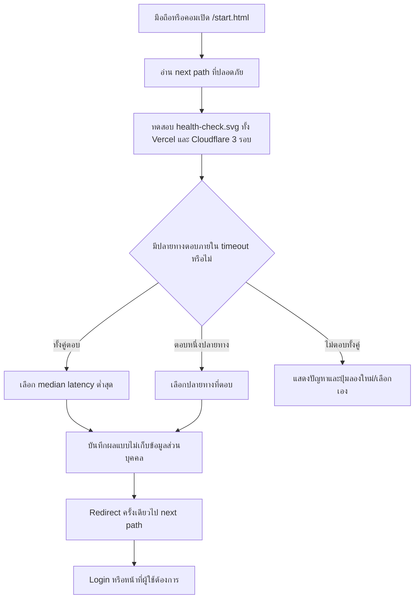

# Smart Entry Routing Flow

## วัตถุประสงค์

ให้ผู้ใช้มือถือและคอมพิวเตอร์มีลิงก์กลางที่เข้าถึงได้จาก Cloudflare Pages แล้วตรวจว่า Vercel หรือ Cloudflare Pages ตอบสนองได้และเร็วกว่า ก่อนส่งผู้ใช้เข้าโปรแกรมจริง โดยไม่พึ่งโค้ดจากโดเมนที่อาจถูกผู้ให้บริการเครือข่ายบล็อก

## Inputs / Outputs / States

- **Inputs:** `next` path ภายในระบบ (ค่าเริ่มต้น `/login`), health endpoint ของ Vercel และ Cloudflare, timeout ต่อรอบ
- **Outputs:** ปลายทางที่ตอบได้เร็วกว่า, latency ที่วัดได้, หรือหน้าช่วยเหลือเมื่อไม่มีปลายทางตอบ
- **States:** `idle` → `probing` → `selected` → `redirecting`; หากล้มเหลวเป็น `unavailable` และให้ retry/เลือกเอง

## Roles / Permissions

- ใช้ได้ก่อน Login ทุกบทบาท เพราะ health endpoint เป็นไฟล์คงที่และไม่อ่านข้อมูลบริษัทหรือผู้ใช้
- Smart Entry ไม่ให้สิทธิ์เพิ่ม; หน้า Login และ Router guard เดิมยังเป็นผู้ตรวจสิทธิ์

## Integrations

- Vercel Production: `https://wisdomai-react.vercel.app`
- Cloudflare Pages Production: `https://wisdomai.pages.dev`
- ใช้ static image probe เพื่อรองรับ browser มือถือและหลีกเลี่ยงข้อจำกัด CORS

## Failure / Retry

- ทดสอบ 3 รอบต่อปลายทางและเลือก median เพื่อลดผลจาก network spike
- timeout ต่อรอบ 2.5 วินาที; ปลายทางที่ตอบไม่ได้ไม่นำมาเลือก
- ถ้าทั้งคู่ล้มเหลว ไม่ redirect วน แต่แสดงปุ่มลองใหม่และลิงก์เลือกปลายทางเอง
- Redirect ไป `/start.html` ไม่ได้ และ `next` ต้องเป็น path ภายในเท่านั้น เพื่อป้องกัน open redirect

## Audit / Privacy

- เก็บผลล่าสุดเฉพาะใน `sessionStorage` ของเครื่อง: host, latency, เวลา และผลสำเร็จ; ไม่ส่ง email, token, IP หรือข้อมูลบุคคล
- Console log ใช้ชื่อเหตุการณ์ `smart-entry` โดยไม่บันทึก secret

## Owner

- Platform / Application Routing Owner

## Change record

| Version | Date | Rationale | Impact | Migration | Verification | Rollback |
|---|---|---|---|---|---|---|
| v1.0 | 22/8/2569 | รองรับเครือข่ายที่เข้า `.app` ไม่ได้และเลือกปลายทางเร็วที่สุดบนมือถือ/คอม | ลิงก์เข้าใช้งานใหม่ `/start.html`; ไม่เปลี่ยน Login หรือข้อมูล | ไม่มี | targeted test, lint, build, เปิดหน้า launcher และตรวจ redirect จริง | หยุดเผยแพร่ลิงก์ `/start.html` และลบไฟล์ static; URL เดิมยังใช้ได้ |
