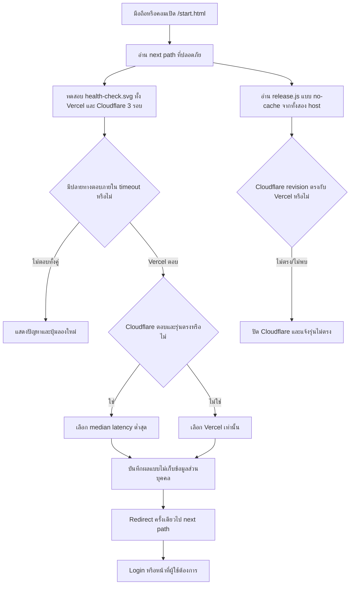

# Smart Entry Routing Flow

## วัตถุประสงค์

ให้ผู้ใช้มือถือและคอมพิวเตอร์มีลิงก์กลางที่ตรวจทั้งความพร้อมใช้งานและ **Revision ของ release** ก่อนส่งผู้ใช้เข้าโปรแกรมจริง ระบบจะเลือก Cloudflare Pages ได้เฉพาะเมื่อ release revision ตรงกับ Vercel Production จึงไม่พาผู้ใช้ไปหน้าเก่าที่ตอบเร็วกว่า

## Inputs / Outputs / States

- **Inputs:** `next` path ภายในระบบ (ค่าเริ่มต้น `/login`), health endpoint, `release.js` ของ Vercel/Cloudflare และ timeout ต่อรอบ
- **Outputs:** ปลายทางที่ revision ตรงกับระบบหลักและตอบได้เร็วกว่า, latency/revision ที่แสดงบนหน้า หรือหน้าช่วยเหลือเมื่อไม่มีปลายทางที่ปลอดภัย
- **States:** `idle` → `probing` → `current`/`stale`/`unknown` → `selected` → `redirecting`; `stale` และ `unknown` ไม่ถูกเลือก

## Roles / Permissions

- ใช้ได้ก่อน Login ทุกบทบาท เพราะ health endpoint เป็นไฟล์คงที่และไม่อ่านข้อมูลบริษัทหรือผู้ใช้
- Smart Entry ไม่ให้สิทธิ์เพิ่ม; หน้า Login และ Router guard เดิมยังเป็นผู้ตรวจสิทธิ์

## Integrations

- Vercel Production: `https://wisdomai-react.vercel.app`
- Cloudflare Pages Production: `https://wisdomai.pages.dev`
- Vite สร้าง `release.json` และ `release.js` ทุก build; Smart Entry โหลด `release.js` แบบ script เพื่ออ่าน revision ข้าม origin โดยไม่ต้องเปิด CORS
- `public/_headers` กำหนด no-cache ให้ release manifest บน Cloudflare Pages เพื่อไม่อ่าน revision เก่า

## Failure / Retry

- ทดสอบพร้อมกัน 3 probe ต่อปลายทางและเลือก median เพื่อลดผลจาก network spike โดยไม่รอ timeout ต่อกันหลายรอบ
- timeout ต่อรอบ 2.5 วินาที; ปลายทางที่ตอบไม่ได้ไม่นำมาเลือก
- Cloudflare ที่ revision ไม่ตรงหรืออ่าน Release ID ไม่ได้จะถูกปิดจาก auto route และลิงก์เลือกเอง; ถ้า Vercel ตอบได้ระบบจะใช้ Vercel เท่านั้น
- ถ้าไม่มีปลายทางที่ปลอดภัย ไม่ redirect วน แต่แสดงปุ่มลองใหม่
- Redirect ไป `/start.html` ไม่ได้ และ `next` ต้องเป็น path ภายในเท่านั้น เพื่อป้องกัน open redirect

## Audit / Privacy

- เก็บผลล่าสุดเฉพาะใน `sessionStorage` ของเครื่อง: host, latency, revision, parity state, เวลา และผลสำเร็จ; ไม่ส่ง email, token, IP หรือข้อมูลบุคคล
- Console log ใช้ชื่อเหตุการณ์ `smart-entry` โดยไม่บันทึก secret

## Owner

- Platform / Application Routing Owner

## Change record

| Version | Date | Rationale | Impact | Migration | Verification | Rollback |
|---|---|---|---|---|---|---|
| v1.0 | 22/8/2569 | รองรับเครือข่ายที่เข้า `.app` ไม่ได้และเลือกปลายทางเร็วที่สุดบนมือถือ/คอม | ลิงก์เข้าใช้งานใหม่ `/start.html`; ไม่เปลี่ยน Login หรือข้อมูล | ไม่มี | targeted test, lint, build, เปิดหน้า launcher และตรวจ redirect จริง | หยุดเผยแพร่ลิงก์ `/start.html` และลบไฟล์ static; URL เดิมยังใช้ได้ |
| v1.1 | 23/8/2569 | ป้องกัน Cloudflare รุ่นเก่าถูกเลือกเพียงเพราะตอบเร็วกว่า | เพิ่ม release manifest, parity check และปิดลิงก์ปลายทางที่รุ่นไม่ตรง; ไม่เปลี่ยน Login/ข้อมูล | ไม่มี | smart-entry/release tests, lint, build, ตรวจ manifest ของทั้งสอง host หลัง deploy | revert parity gate และ manifest ได้; ควร rollback ทั้งสอง host เป็น revision เดียวกัน |
