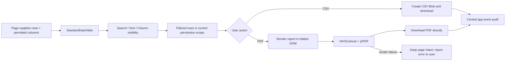

# Standard Data Table: Table Tools and Direct PDF Export

เอกสารอ้างอิงกลางของ `src/components/StandardDataTable.tsx` ซึ่งใช้แสดง ค้นหา จัดเรียง เลือกคอลัมน์ รีเฟรช และส่งออกข้อมูลของตารางในแต่ละ Module

## Inputs and outputs

- **Inputs:** `rows`, column definitions permitted for the current company role, search text, sort, visible columns, title, metadata and summary supplied by the page.
- **Output:** only the rows after search/sort and only visible/exportable columns. CSV is a UTF-8 Blob; PDF is a browser-downloaded `.pdf` file, not a print dialog.
- **Scope:** the page owns data loading, permission and global filters. The table never broadens the query or exposes a hidden column.

## State, roles and integrations

- Browser state stores search, pagination, sort and column visibility per table key in local/session storage.
- `allowedCompanyRoles` is applied before rendering, export and column settings.
- PDF integration uses browser-side `html2canvas` and `jsPDF`; no document data is sent to a new external service.
- Export records central `logAppEvent` event `export_data` with format, file name, row count and company id.
- **Owner:** Platform UI / System Admin. Each page remains owner of its source query and refresh behavior.

## Failure and recovery

- Empty data disables export actions.
- If PDF generation fails, the temporary render node is removed, the page data remains unchanged and the user receives a clear error message; they can retry the same export.
- Popup blocking and `window.print()` are not part of the direct-PDF path.
- PDF is generated from the currently permitted browser view; sensitive fields remain excluded by the same column-role rule.

## Responsive behavior

- At 320–768px, the table keeps all permitted columns and provides touch-friendly horizontal scrolling rather than hiding business-critical data. A visible scroll hint appears when overflow is measured.
- Search, sort, column visibility, CSV, PDF, refresh, pagination, and row actions use the same filtered rows and permission scope as Desktop. Toolbar actions wrap vertically on small screens.
- The table does not change the page query, company scope, Project scope, mutation, or audit behavior when rendered on mobile.

## Change record

| Version | Date | Rationale / impact | Migration | Verification | Rollback |
|---|---|---|---|---|---|
| v1.0 | 20/8/2569 | Registered the shared table flow and changed PDF export from print-window flow to direct browser PDF download. | None | TypeScript, lint, standard-table test, build and real Document Flow page export | Restore prior `window.print()` implementation and remove direct-export dependencies; no business data changes. |
| v1.1 | 20/8/2569 | Fixed blank PDFs: the temporary report is rendered inside the layout viewport while a separate export mask prevents it from flashing on screen. | None | TypeScript, lint, build and direct PDF download from Document Flow | Restore the previous temporary-report placement; no business data changes. |
| v1.2 | 26/8/2569 | Add compact toolbar and on-demand search control so pages can collapse the built-in search field into a top-level icon action without changing rows, export scope, or stored table state. | None | `test:standard-table-sorting`, lint, build and the pages that now open search from their own header | Revert the compact toolbar/search toggle wiring; table rows, exports and persistence remain unchanged. |
| v1.3 | 4/9/2569 | Add touch horizontal-scroll guidance for overflowing tables without hiding columns or changing export scope | `test:mobile-responsive`, targeted lint/typecheck and desktop/mobile table smoke | remove the scroll hint/style only; table data and export scope remain unchanged |
