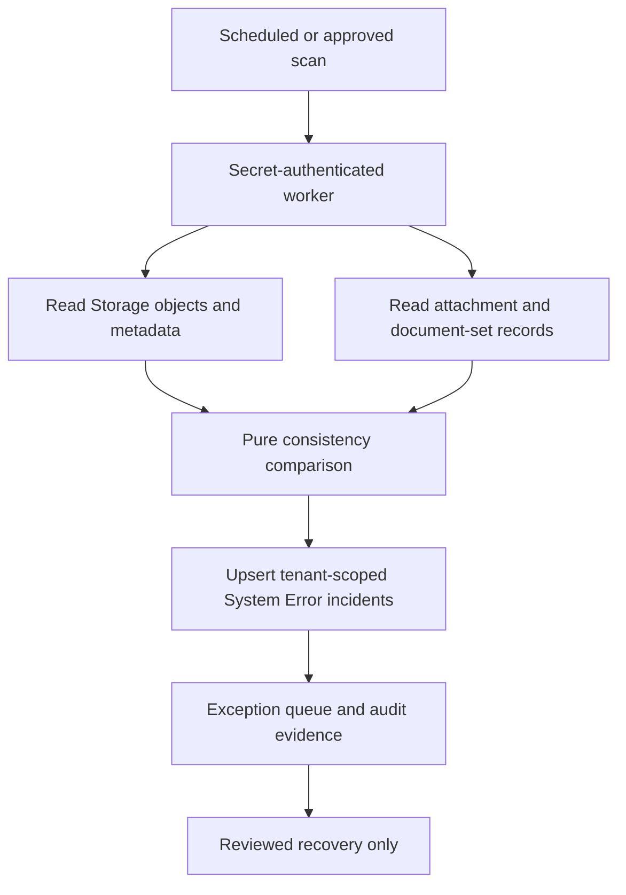

# Storage Database Consistency Flow

## Purpose

The `storage-consistency-worker` compares the private `line-attachments` bucket with `line_attachment_blobs`, document-set page counts, thumbnail references, content hashes, and the required `{company_id}/...` namespace. The response records checked counts, findings by type, repair counts, incident create/update counts, and unresolved findings.

## Inputs and outputs

The worker accepts a POST body with `action: scan`, optional `batch_limit`, and optional `verify_hashes`. The platform JWT gate is intentionally disabled for this service-to-service worker, and the worker requires the `STORAGE_CONSISTENCY_WORKER_SECRET` header as its custom authentication gate. It returns a bounded, read-only consistency report and upserts tenant-scoped incidents through the existing RPC.

## States, roles, and integrations

Only the Edge Function service role may enumerate private objects and call `upsert_system_error_event`. Findings are `orphan_object`, `dangling_db`, `missing_thumbnail`, `missing_page`, `hash_mismatch`, or `wrong_tenant_namespace`. The System Error and document storage queues are the human destination.

## Failure, retry, and audit

Method, secret, configuration, query, storage-list, and scope errors return explicit non-success responses. Repeating a scan is idempotent at incident level because the fingerprint includes finding type, company, and identity. Each finding is preserved as evidence; no delete, move, overwrite, metadata rewrite, or page-count repair is attempted.

## Recovery and ownership

There is currently no lossless automatic object repair. A tenant owner must review an incident and approve a recovery plan before any object move, metadata rewrite, or record correction. Owner: Document Intake and Platform Operations.

## Change record

- Version: 1.0.0
- Date: 2026-09-07
- Rationale: deploy the already-reviewed source-only consistency worker through the standard GitHub and Supabase workflow.
- Impact: adds a secret-authenticated read-only scanner and tenant-scoped exception evidence; no production data mutation.
- Migration: none.
- Verification: pure scanner fault-injection test, lint, build, GitHub workflow, deployed function listing, authenticated page smoke, and a secret-authenticated scan when the production secret is available.
- Rollback: revert the release commit; the function is then absent/disabled and existing Storage objects remain untouched.
