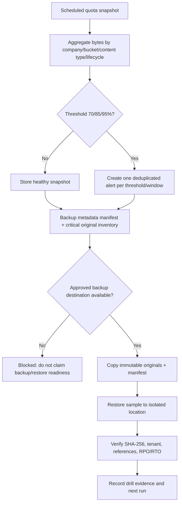

# Storage Quota, Backup & Restore Drill Flow

## Scope and safe boundary

This flow defines quota monitoring and a restore drill. Quota snapshots are read-only aggregates. Backup/restore must never overwrite live objects, and a restore sample must use an isolated destination before an administrator approves any replacement.

## Inputs, outputs and thresholds

- Input: company, bucket, content type, retention class, lifecycle state, `size_bytes`, and the snapshot time.
- Output: usage percentage, threshold (`70`, `85`, `95`), deduplicated alert event, backup manifest, restore hash comparison, RPO and RTO evidence.
- Thresholds are evaluated once per company/scope/window; repeated scans update the same event rather than spamming alerts.

## Backup and restore requirements

The manifest must include blob id, tenant, bucket/path, content hash, size, lifecycle state, retention class and legal-hold state. Critical originals remain immutable. A restore drill must prove that the sample hash and metadata match and must record the elapsed restore time (RTO) and snapshot age (RPO).

## Roles and permissions

Platform Operations owns scheduling and evidence. Tenant Admin approves any restore of live data. The service role may read metadata and write audit/snapshot records, but must not delete or overwrite live objects during a drill.

## Current blocker

The Supabase Free plan has no point-in-time recovery, and this repository has no configured external backup destination/credential. Therefore this task must not pretend that backup or restore readiness is complete. Quota read-only reporting and the drill contract can be prepared; the first real backup/restore run requires an approved destination, retention policy, and owner authorization.

## Change record

### v1.0 — 7/9/2569

- Rationale: establish a safe quota/RPO/RTO contract without destructive or unrecoverable writes.
- Impact: documentation only; no live data, Storage object or migration changed.
- Verification: schema inspection confirmed attachment metadata/hash fields and existing storage reports; no backup claim made.
- Rollback: remove this document and registry entry; no runtime data is affected.
