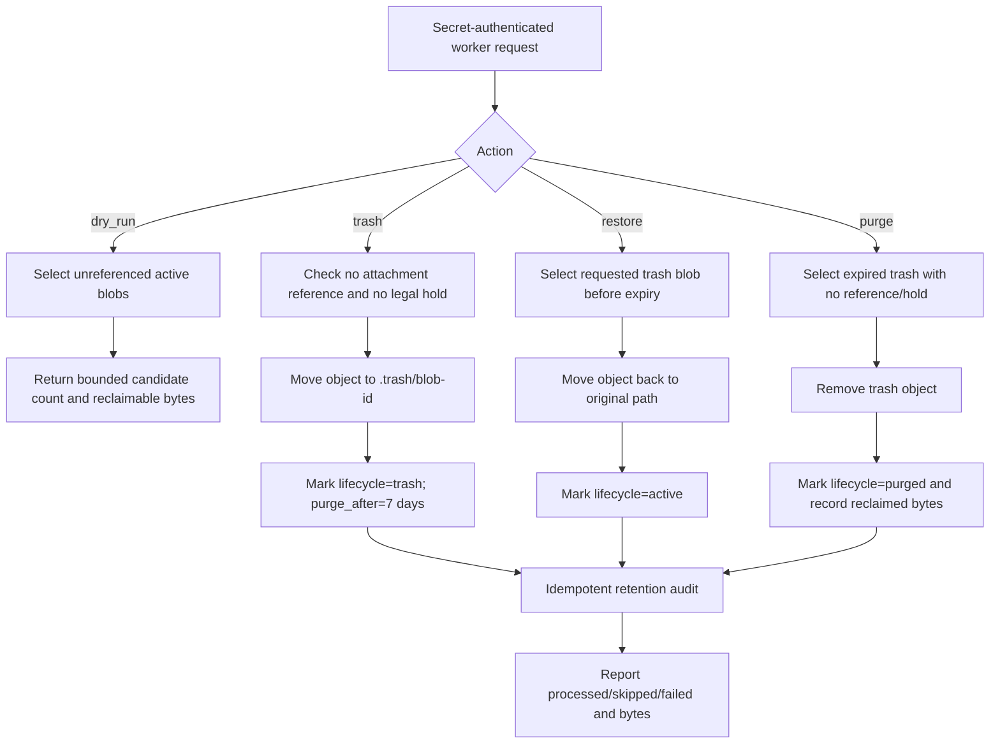

# Storage Retention, Trash, Restore & Purge Flow

## Purpose and operational path

`storage-retention-worker` manages unreferenced private LINE attachment blobs without deleting them immediately. A dry-run is available before mutation; trash keeps an object for seven days, restore is allowed before expiry, and purge requires expiry plus no reference and no legal hold.

## Inputs, outputs, and states

- Input: `POST` with `x-storage-retention-secret`, `action` (`dry_run`, `trash`, `restore`, `purge`), bounded `batch_limit` (1–100), and `blob_id` for restore.
- Output: JSON counts (`processed`, `skipped`, `failed`), failure ids, `bytes_reclaimed`, and dry-run `bytes_reclaimable`.
- State: `active → trash → purged`; `trash → active` is the restore path. A blob with an attachment reference or `legal_hold=true` is never selected.

## Roles, permissions, and integrations

Only the server-side worker with the configured secret and Supabase service role may enumerate candidates or call the retention RPCs. The storage bucket remains private. `storage_retention_audit` is append-only evidence for every successful state transition.

## Failure, retry, idempotency, and recovery

Candidate selection is bounded and state-guarded. Repeating an action after a successful transition returns it as skipped rather than applying it again. If recording a trash/restore transition fails, the worker attempts to move the object back to its previous path. Purge is only eligible after the seven-day window and is excluded by legal hold/reference checks. Failed items are returned individually for retry; raw attachment metadata is retained for recovery.

## Audit and monitoring

Every successful transition writes `storage_retention_audit` with blob id, action, operation key, path and reclaimed bytes. The worker response is the operational evidence for a dry-run or batch run; scheduled callers must retain that response and alert on non-zero failures.

## Owner

Platform/Document Storage owns the worker and lifecycle policy. Tenant Admin/Document Operations owns legal holds, restore approval, and purge scheduling.

## Change record

### v1.0 — 7/9/2569

- Rationale: document the already-implemented retention worker and close the DOC-INGEST-008 flow-registration gap.
- Impact: documentation and registry only; the existing migration/RPCs and Edge Function behavior are unchanged.
- Migration: `202608160024_storage_retention_lifecycle.sql` is applied in Production; no new migration.
- Verification: contract test `npm.cmd run test:storage-retention`; Production migration history and Edge Function version inspected; no purge or data mutation performed.
- Rollback: remove this flow document and registry entry; retention tables, objects and audit history remain unchanged.
