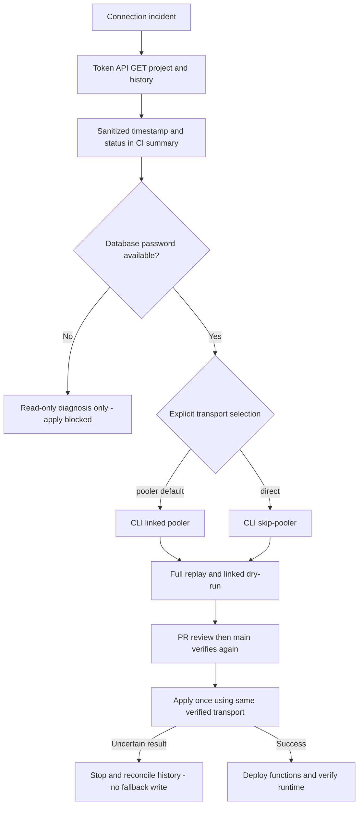

# Supabase connection recovery

Version 2026-09-05; owner Platform; task SYS-CICD-001.

## Three routes, not three independent credentials

1. Management API over HTTPS: `npm run check:supabase-connection`.
   Needs SUPABASE_ACCESS_TOKEN and SUPABASE_PROJECT_REF. GET only, validates
   project ID and history response. Minimum scoped token permissions:
   Project Settings Read and Migrations Read. Never returns names, SQL, raw
   errors or credential values. A successful read does NOT approve a migration.
2. CLI via pooler: default existing migration route. Needs token, project ref
   and SUPABASE_DB_PASSWORD. Password remains in environment, never argv.
3. CLI direct: set repository VARIABLE SUPABASE_DB_TRANSPORT to `direct`.
   Same credentials; useful for pooler/network failures, NOT forgotten passwords.
   Requires runner network reachability to the direct endpoint (often IPv6).
   Set variable back to `pooler` to recover. Run verification after any change.

The workflow freezes the chosen route as verify-migrations job output and uses
that output for apply. No automatic transport fallback, retries, history repair,
credential rotation, SQL API writes or Production password reset is implemented.
Unknown transport values fail closed. All existing required checks remain.
connection-diagnostics runs independently so a missing database password does
not prevent obtaining API evidence, but it never substitutes for linked dry-run.

## When access succeeds

Read the CI job summary: timestamp, sanitized failure category and remote history
count. Record commit, workflow URL, checked route, credential owner/expiry (not
value), last successful verification and next action in the handoff. Do not
confuse secret-name presence with validated credentials. Fix only the diagnosed
problem. On 401 verify expiry; on 403 review only required scopes; on 429 wait
before an explicit retry. Never repeatedly retry denied credentials.

Compare remote versions and schema with repository migrations before changing
the apply mechanism. An API-based migration writer is NOT shipped: equivalence
of version IDs, replay, dry-run, locking and uncertain-write recovery must first
be demonstrated. Do not manually apply/repair history merely to unblock CI.

Secrets stay in GitHub Actions Secrets or an approved credential manager, never
VITE_ variables, source, reports or chat. These credentials do not replace the
web application's existing Supabase URL/API key. No frontend routes, RLS, raw
business data or financial transactions change in this implementation.

## Verification and rollback

Run `npm run test:supabase-connection`, deployment workflow contracts, typecheck,
lint and build. Fixture tests are isolated and never contact Production. GitHub
runtime verification is still required. Revert the task commit on the task
branch for source rollback; no database rollback is needed. Do not merge while
the linked dry-run or history review is blocked. No promise of outage prevention:
API and Postgres routes still depend on Supabase and credential availability.

References:
- https://supabase.com/docs/reference/api/v1-list-migration-history
- https://supabase.com/docs/guides/platform/personal-access-tokens
- https://supabase.com/docs/reference/cli/supabase-link
