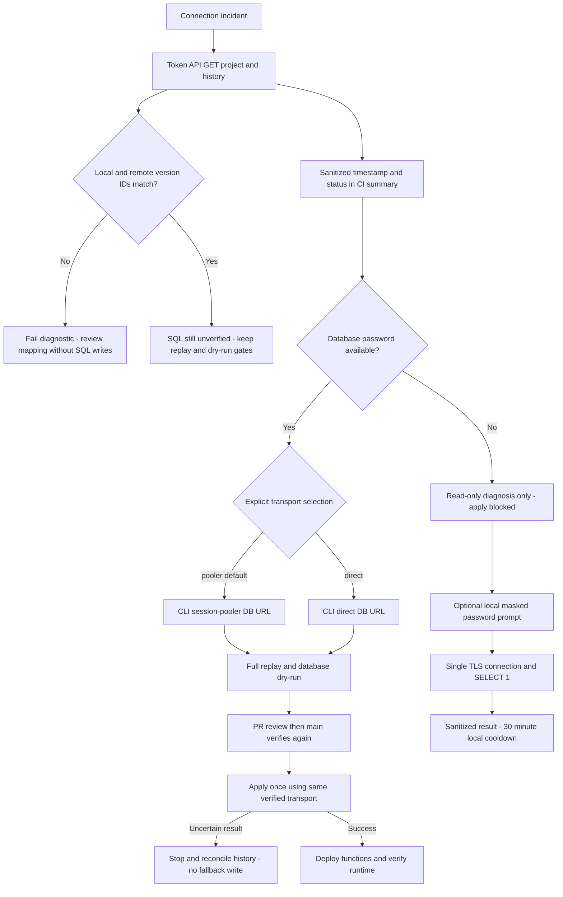

# Supabase connection recovery

Version 2026-09-05; owner Platform; tasks SYS-CICD-001 and SYS-CICD-002.

## Three routes, not three independent credentials

1. Management API over HTTPS: `npm run check:supabase-connection`.
   Needs SUPABASE_ACCESS_TOKEN and SUPABASE_PROJECT_REF. GET only, validates
   project ID and history response. Minimum scoped token permissions:
   Project Settings Read and Migrations Read. Never returns names, SQL, raw
   errors or credential values. A successful read does NOT approve a migration.
2. CLI via pooler: default migration route. Needs project ref and
   SUPABASE_DB_PASSWORD. It bypasses Management API linking after scoped PATs
   returned 403 for the project/ref pair. Password remains in `PGPASSWORD`; the
   `--db-url` argument contains no password and pins the repository CA.
3. CLI direct: set repository VARIABLE SUPABASE_DB_TRANSPORT to `direct`.
   Same database credentials; useful for pooler/network failures, NOT forgotten passwords.
   Requires runner network reachability to the direct endpoint (often IPv6).
   Set variable back to `pooler` to recover. Run verification after any change.

The workflow freezes the chosen route as verify-migrations job output and uses
that output for apply. No automatic transport fallback, retries, history repair,
credential rotation, SQL API writes or Production password reset is implemented.
Unknown transport values fail closed. All existing required checks remain.
connection-diagnostics runs independently so a missing database password does
not prevent obtaining API evidence, but it never substitutes for database dry-run.

## When access succeeds

Read the CI job summary: timestamp, sanitized failure category, remote history
count and local-only/remote-only version IDs. Drift or duplicate IDs fail the
diagnostic. Matching version IDs do not prove matching SQL or authorize apply.
Record commit, workflow URL, checked route, credential owner/expiry (not
value), last successful verification and next action in the handoff. Do not
confuse secret-name presence with validated credentials. Fix only the diagnosed
problem. On 401 verify expiry; on 403 review only required scopes; on 429 wait
before an explicit retry. Never repeatedly retry denied credentials.

Compare remote versions and schema with repository migrations before changing
the apply mechanism. An API-based migration writer is NOT shipped: equivalence
of version IDs, replay, dry-run, locking and uncertain-write recovery must first
be demonstrated. Do not manually apply/repair history merely to unblock CI.

Secrets stay in GitHub Actions Secrets or an approved credential manager, never
VITE_ variables, source, reports or chat. These credentials do not replace the
web application's existing Supabase URL/API key. No frontend routes, RLS, raw
business data or financial transactions change in this implementation.

## Verification and rollback

### Local one-attempt password window

`tools/db-password-test/Open-Password-Test.ps1` opens a native Windows form.
Install its isolated dependencies with `npm ci --ignore-scripts` in that folder.
No app dependency changes. The password is masked and sent only over the local
child process stdin, then through certificate-verified TLS to the fixed WisdomAI
session pooler on port 5432. The session pooler is used because the direct
database hostname has no usable DNS address on the current IPv4-only network.
The helper pins the official `prod-ca-2021.crt` downloaded from the Project's
Database Settings page and keeps certificate and hostname verification enabled.
No HTTP listener, password log, clipboard access or
credential persistence. Plaintext necessarily exists briefly in process memory;
this is not a memory-hardening or forensic-erasure guarantee.

One Client, one connect, SELECT 1 in a default-read-only session, no retries.
The form disables its button and uses an exclusively locked timestamp file to
enforce a 30-minute local cooldown across windows. Never delete this marker to
guess more passwords. It does not know about attempts from other tools/IPs.
Network/DNS, TLS verification, authentication rejection and unknown failures
are distinct outcomes; never disable TLS verification to make a test pass.
No claim that a failed network test proves the password incorrect. A successful
test does not save GitHub secrets, approve migrations or deploy anything.

Tests: `npm test` in that folder uses a fake Client, never a real password.
`-ValidateOnly` constructs/disposes the form without connecting. Production
authentication remains untested until the user enters a known candidate and
presses Test ONCE. Close the window to stop; no database rollback is needed.
PowerShell execution policy may require process-scoped execution permission;
do not change machine-wide policy. The local helper is not a production website.

Run `npm run test:supabase-connection`, deployment workflow contracts, typecheck,
lint and build. Fixture tests are isolated and never contact Production. GitHub
runtime verification is still required. Revert the task commit on the task
branch for source rollback; no database rollback is needed. Do not merge while
the linked dry-run or history review is blocked. No promise of outage prevention:
API and Postgres routes still depend on Supabase and credential availability.

References:
- https://supabase.com/docs/reference/api/v1-list-migration-history
- https://supabase.com/docs/guides/platform/personal-access-tokens
- https://supabase.com/docs/reference/cli/supabase-link
