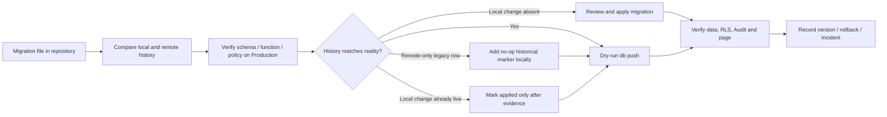

# Supabase Migration Governance Flow

## วัตถุประสงค์

ทำให้ประวัติ migration ในโครงการตรงกับฐานข้อมูล Production ก่อนเปลี่ยน schema ครั้งถัดไป เพื่อไม่ให้ `db push` หยุดกลางทางหรือ apply migration เก่าซ้ำโดยไม่ตั้งใจ

## กติกา

- Input: migration ใน `supabase/migrations`, remote migration history และ schema/function/policy จริง
- Output: history ที่สอดคล้อง, dry-run ผ่าน, และรายการ schema เปลี่ยนแปลงมี migration source อยู่ในโครงการ
- สิทธิ์: เฉพาะผู้ดูแลที่มีสิทธิ์ Supabase project; ไม่มี Service Role ใน Browser
- Failure/retry: ถ้า history ต่างกัน ห้ามใช้ `migration repair --status reverted` เพียงเพื่อให้ push ผ่าน ต้องตรวจ schema ก่อน; remote-only ใช้ no-op marker, local change ที่พิสูจน์ว่าอยู่จริงจึง mark applied
- Audit: เก็บ migration version, หลักฐาน schema, ผู้ดำเนินการ, ผล dry-run/apply และ rollback ใน Flow Registry protocol
- Owner: Platform Admin / ผู้ดูแลฐานข้อมูล

## Change record

| Version | Date | Rationale | Impact | Migration | Verification | Rollback |
| --- | --- | --- | --- | --- | --- | --- |
| v1.0 | 22/8/2569 | กู้ความสอดคล้องของ migration history หลังพบ remote history ไม่มีไฟล์ local และ local history ไม่ถูก mark | ทุกงาน schema บน Supabase | Historical markers + repair เฉพาะรายการที่ตรวจ schema แล้ว | `migration list`, schema query, `db push --dry-run` | ลบ marker local ได้; ห้าม revert remote history โดยไม่ตรวจ schema/backup |
