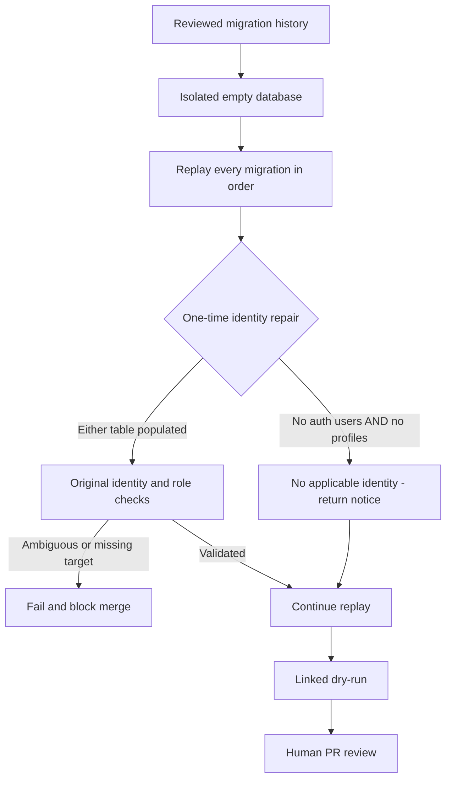

# Supabase Replay Flow - SYS-CICD-001

Version: 2026-09-04. Owner: Platform / database maintainer.

Inputs are versioned SQL and an isolated database, never copied personal data.
Outputs are the CI replay result and a reviewed dry-run; successful targeted
tests alone do not establish migration history or Production readiness.

The two historical Telegram identity repairs (202608090018 and 202608090019)
have no applicable record before any auth user or profile exists. They now
return a notice only in that state. Once either table contains data, all
original missing/ambiguous identity, company and admin-role checks still run.
No global CI skip flag, exception suppression or fake identity is used.
Do not replay these repairs manually on Production.

`npm run test:legacy-identity-replay` executes both actual migration files in
in-memory PostgreSQL across pristine, auth-only, profile-only and populated
scenarios. Pristine replay is repeated to verify idempotency. Other scenarios
must still fail on an unmatched target. It performs no network or business writes.

Changes to already-applied SQL affect fresh replay, not an existing applied
version. Remote history parity and the provisional profiles/projects foundation
must still be reviewed before merge. Do not repair remote history to hide drift.

Audit: retain CI logs, PR review and work-item evidence. Retry only after a
specific failure is diagnosed. Rollback before merge is a new revert commit
on the task branch; no Production rollback is needed because nothing is applied.

Source reference: https://supabase.com/docs/guides/deployment/database-migrations
