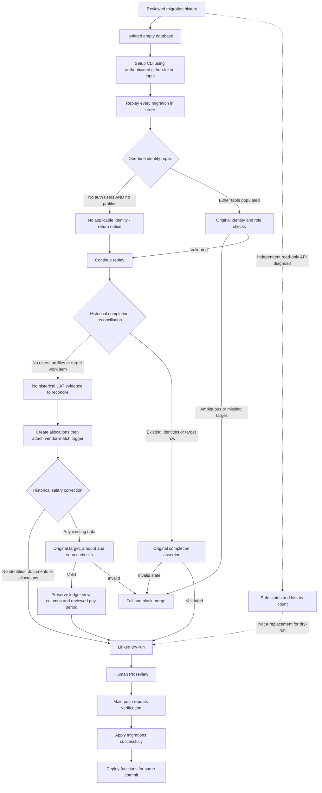

# Supabase Replay Flow - SYS-CICD-001

## 2026-09-05 CLI authentication correction

Run 33927609285 failed CLI release resolution with a rate limit. The setup-cli
action reads `core.getInput('github-token')`, not the GITHUB_TOKEN environment
variable previously supplied. All three setup steps now pass the standard
read-only workflow token through `with.github-token`. No new secret or expanded
permission is required. Regression contracts check each step and reject a
missing/misnamed input. This fixes input wiring, not a guarantee against all
rate limits. Full CI replay and linked dry-run remain required.

The same run successfully read Production migration history through the API,
but detected version mismatch. Do not repair history or apply to bypass that
finding. Source: https://github.com/supabase/setup-cli/blob/v1/src/main.ts.
Rollback: revert this task-branch change; no database mutation is involved.

Connection recovery v2026-09-05: see `SUPABASE_CONNECTION_RECOVERY.md` for the
password-independent API diagnostic and explicit pooler/direct transports.
All apply gates below remain mandatory; no fallback API write is enabled.

Version: 2026-09-04. Owner: Platform / database maintainer.

Inputs are versioned SQL and an isolated database, never copied personal data.
Outputs are the CI replay result and a reviewed dry-run; successful targeted
tests alone do not establish migration history or Production readiness.

The two historical Telegram identity repairs (202608090018 and 202608090019)
have no applicable record before any auth user or profile exists. They now
return a notice only in that state. Once either table contains data, all
original missing/ambiguous identity, company and admin-role checks still run.
No global CI skip flag, exception suppression or fake identity is used.
Do not replay these repairs manually on Production.

`npm run test:legacy-identity-replay` executes both actual migration files in
in-memory PostgreSQL across pristine, auth-only, profile-only and populated
scenarios. Pristine replay is repeated to verify idempotency. Other scenarios
must still fail on an unmatched target. It performs no network or business writes.

Changes to already-applied SQL affect fresh replay, not an existing applied
version. Remote history parity and the provisional profiles/projects foundation
must still be reviewed before merge. Do not repair remote history to hide drift.

Audit: retain CI logs, PR review and work-item evidence. Retry only after a
specific failure is diagnosed. Rollback before merge is a new revert commit
on the task branch; no Production rollback is needed because nothing is applied.

Source reference: https://supabase.com/docs/guides/deployment/database-migrations

## 2026-09-05 replay follow-up

CI run 33915679999 passed the identity guards and failed at 202608150016:
the historical LINE completion assertion expected a work item absent from a
fresh installation. It now returns only if auth users, profiles and the target
work item are all absent. Existing identities or a target in any scope retain
the assertion. No completed work item or UAT evidence is synthesized.

The same test command now runs 14 PostgreSQL scenarios. The six reconciliation
cases cover pristine repeated replay, auth-only, profile-only, invalid target,
wrong-scope target and a valid review target. They verify preserved prior
evidence, idempotency and unchanged unrelated rows. Full replay is still required.

CI run 33916274015 passed that guard and reached a dependency-order failure:
20260826044252 attached a trigger to allocations created by 20260826220000.
The earlier migration attaches immediately when the table already exists;
the table-creation migration always attaches it after creation. The vendor
validation function and its matching rules are unchanged. Migration filenames
and remote history are unchanged; do not manually reapply them to Production.

`node scripts/vendor-trigger-replay.test.mjs` executes the actual trigger SQL
and table-creation SQL in isolated PostgreSQL for fresh and existing tables.
It checks repeated installation, rejected unmatched vendor insert/update,
accepted matched confirmation and unchanged non-vendor behavior. This scoped
test does not replace full migration replay or linked dry-run.

CI run 33916675589 passed vendor table attachment and found a missing fixed
salary-correction target now re-versioned at 20260905110100. This correction
returns only when auth users, profiles, document items and allocations are all
empty. Its target, amount and source checks remain unchanged for populated
databases. No payroll record, confirmation or audit evidence is fabricated.

`node scripts/salary-correction-replay.test.mjs` executes the complete SQL in
five isolated PostgreSQL scenarios: pristine repeated replay and each of the
four guarded tables populated independently. It asserts original rejection
when the historical target is absent and verifies no rows/evidence are created
or deleted. Full CI replay and linked dry-run remain required before merge.

CI run 33917055323 passed the salary correction and failed at 20260830101500:
the replacement ledger view omitted existing assignment method/reason columns
and the canonical reviewed-period join. Restore the prior column order, join
and coalesce expression; preserve security_invoker and grants without dropping
the view. `node scripts/ledger-view-replay.test.mjs` executes the previous view
then the replacement twice and verifies schema compatibility, reviewed-period
precedence, allocation fallback, version metadata and access properties.

## 2026-09-05 completion safeguards

The SQL gate now checks added and modified SQL paths using Git's NUL-delimited
output. It tokenizes multiline input, strips comments/quoted values and scans
dollar-quoted routine bodies. It blocks DROP TABLE/COLUMN, TRUNCATE and DELETE
or UPDATE lacking an outer WHERE. A WHERE inside a subquery does not qualify.
Dynamic EXECUTE and single-quoted routine bodies require explicit review.
ON CONFLICT DO UPDATE is scoped by its conflict key and is not an unrestricted
UPDATE. Ambiguous/unterminated tokens fail closed. This conservative guard is
not an SQL parser, authorization boundary or proof against destructive intent;
human review and actual replay/dry-run remain mandatory. An intentional flagged
change requires the existing ALLOW-DESTRUCTIVE-MIGRATION marker and review.

The functions workflow is reusable only. The main migration workflow calls it
after apply-migrations succeeds, with explicit secret forwarding. Function-only
changes also trigger migration verification. Ref-level concurrency avoids
overlapping main releases and never cancels an in-flight apply. Dispatch runs
verification only; PRs cannot apply or deploy. CLI setup receives the standard
GitHub token to avoid unauthenticated release lookup limits.

The foundation now creates/sets RLS/comments only on absent tables. Existing
tables retain their state. It remains a minimal replay baseline, not a verified
export of Production schema; compare remote history and dry-run before merge.

`npm run test:migration-safety` covers lexical rejection/allowance, temporary Git
repositories with modified/added spaced filenames, overrides/no-op, baseline
creation/existing-state preservation, and all historical replay regressions.
CI runs these tests before the full Supabase replay.

References:
- https://docs.github.com/en/actions/how-tos/reuse-automations/reuse-workflows
- https://github.com/supabase/setup-cli

Recovery: keep changes on the task branch while credentials/history block the
dry-run. Revert a reviewed task commit if needed; do not reset history, remove
the required gate, or run Production SQL manually to make CI pass.
