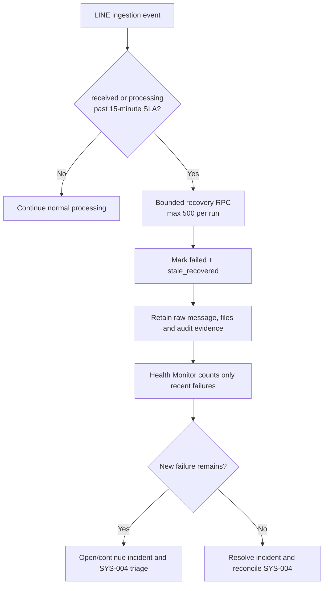

# System Health Monitor Flow

## Scope

Health Monitor checks operational routes and keeps `SYS-004` synchronized with active errors. LINE ingestion is recovered separately from business data: an event that has remained `received` or `processing` beyond the 15-minute SLA is marked `failed` with `processing_stage=stale_recovered`, never deleted and never treated as successfully processed.

## Roles and permissions

The `health-monitor` Edge Function uses the service role for bounded operational recovery. Admins can inspect the resulting error, source message and audit trail. Business users cannot invoke the recovery RPC directly.

## Inputs and outputs

Inputs are LINE ingestion status, received time, company scope and the health-check timestamp. Output is a bounded count of recovered events, a current LINE health result, incident state and the synchronized `SYS-004` evidence/fingerprint.

## Failure, retry and audit

Recovery uses row locks with `skip locked`, validates age and batch bounds, and is safe to repeat. Raw LINE messages, attachments and downstream records are retained. The error message records why recovery occurred; a later reprocess action may retry the original event without creating a duplicate source event.

## State and completion

`received`/`processing` past SLA -> `failed/stale_recovered`. Recent failures still warn or raise critical health status. Once no new failure remains, the existing incident reconciliation may resolve the incident and mark `SYS-004` healthy. A failed recovery leaves the source state unchanged and keeps the incident visible.

## Owner and rollback

Owner: Platform / LINE integration. Rollback is to disable the recovery call and revert the migration; already recovered rows remain explicit failed records and can be reprocessed from their original evidence.
