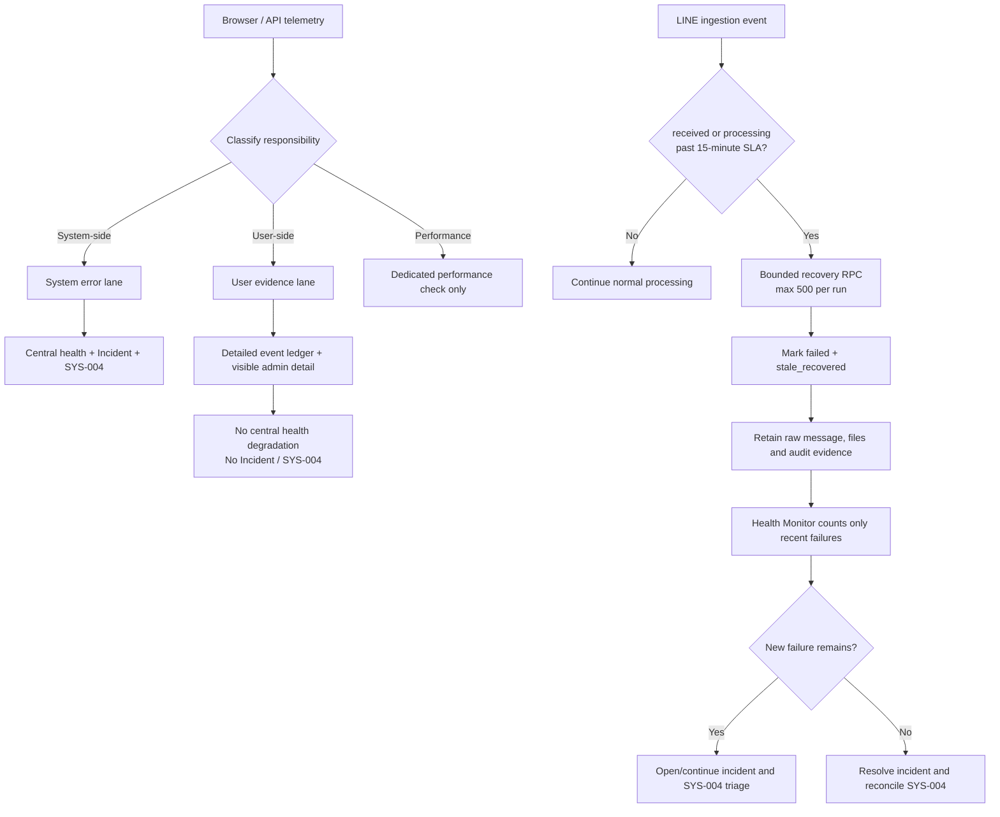

# System Health Monitor Flow

## Scope

Health Monitor checks operational routes and keeps `SYS-004` synchronized with active system errors. Browser telemetry has two responsibility lanes: system-side failures affect central health and incident handling; user-side actions or conditions remain visible with detailed evidence but never make the central system unhealthy. Performance telemetry uses its dedicated performance check and is not counted again as a browser error. LINE ingestion is recovered separately from business data: an event that has remained `received` or `processing` beyond the 15-minute SLA is marked `failed` with `processing_stage=stale_recovered`, never deleted and never treated as successfully processed.

## Roles and permissions

The `health-monitor` Edge Function uses the service role for bounded operational recovery. Admins can inspect system errors and user-side evidence, including event type, page, message, device label, profile, reason, source and time. Business users cannot invoke the recovery RPC directly. User-side classification does not grant any new permission or expose evidence outside the existing Admin health page.

## Inputs and outputs

Inputs include LINE ingestion state and browser activity telemetry (`event_type`, severity, page, message, device label, profile, metadata and time), scoped to the acting company. Outputs include the LINE result plus two browser results: `client_errors` for system responsibility and `user_side_events` for user responsibility. Each browser lane exposes at most 20 recent evidence rows from a bounded 200-row/15-minute query. Only non-healthy system checks contribute to run warning/critical counts, incidents and synchronized `SYS-004` work.

## Failure, retry and audit

New telemetry writes explicit `responsibility_scope` and `event_category`. Legacy telemetry is classified from its explicit scope or known reason allowlist; unknown browser errors default to system-side so real failures are not hidden. Performance events are always routed to the dedicated performance check even when tagged as system telemetry. Recovery uses row locks with `skip locked`, validates age and batch bounds, and is safe to repeat. Raw LINE messages, attachments and downstream records are retained. The error message records why recovery occurred; a later reprocess action may retry the original event without creating a duplicate source event.

## State and completion

Browser system error -> `client_errors` warning/critical -> central health/Incident/SYS-004. Browser user condition -> `user_side_events` healthy evidence -> user support only. Performance metric -> performance check only. `received`/`processing` past SLA -> `failed/stale_recovered`. Once no new system failure remains, existing incident reconciliation may resolve the incident and mark `SYS-004` healthy. A failed recovery leaves the source state unchanged and keeps the incident visible.

## Owner and rollback

Owner: Platform / LINE integration. Rollback is to disable the recovery call and revert the migration; already recovered rows remain explicit failed records and can be reprocessed from their original evidence.

## 2026-09-17 - Browser responsibility split v1.2

- Rationale: distinguish faults owned by the central system from user-side actions and conditions without losing diagnostic evidence.
- Impact: `client_errors` now contains only system-side browser errors; `user_side_events` is a separate always-healthy evidence lane; performance is no longer double-counted. Incident and `SYS-004` behavior is unchanged for genuine system failures.
- Migration: none. Existing `app_activity_logs` rows remain immutable and are classified at read time; new rows receive explicit responsibility metadata.
- Verification: responsibility contract, existing Health Monitor/System Error tests, typecheck, lint, build, Edge Function validation and authenticated `/system-health` smoke including evidence drawer and incident reconciliation.
- Rollback/recovery: revert the classifier, UI and telemetry metadata writer. No event data is deleted. If a legacy system incident was opened from user/performance evidence, run the monitor after release and allow the existing healthy reconciliation to close it while preserving history.

## 2026-09-16 - Edge Function syntax recovery v1.1

- Rationale: restore the intended approval-loop monitor path after a missing function-closing brace prevented the Edge Function bundle from completing.
- Impact: syntax-only recovery; inputs, outputs, states, permissions, integrations, retries, audit events and ownership remain unchanged.
- Migration: none.
- Verification: TypeScript parser regression, approval-loop/health-monitor tests, Supabase function bundle, typecheck, lint, build and authenticated Production smoke.
- Rollback: revert the single closing brace only if a replacement implementation is deployed; no data or audit rows are changed by this recovery.
