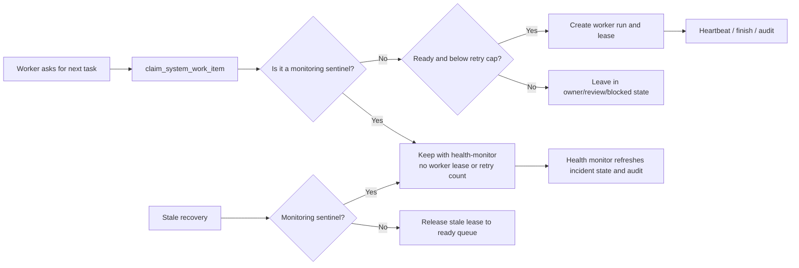

# System Work Claim and Recovery Flow

## Purpose

This flow separates long-lived monitoring records from worker-owned tasks. `SYS-004` is a health-monitor sentinel: it may remain `doing` while no worker owns a lease, because Health Monitor continuously refreshes grouped incidents, evidence, and risk.

## Roles and states

- Health Monitor owns monitoring sentinels and writes only health state, evidence, and audit context.
- Automation Worker may claim only ordinary `ready` items below the retry cap.
- Recovery releases expired worker leases, but must not convert a `monitoring_active%` sentinel to `ready`.
- Admin owns business decisions, retry resets, migration approval, and Production deployment.

## Failure, audit, and recovery

Every claim creates `system_worker_runs` and increments the attempt count once. Heartbeat expiry creates an audited expired run and returns only ordinary orphaned work to the queue. Monitoring records stay out of generic claims and retain their health evidence. A capped normal task requires a root-cause fix and explicit retry reset; no automation bypasses the cap.

## Change record

| Version | Date | Rationale | Impact | Migration | Verification | Rollback |
| --- | --- | --- | --- | --- | --- | --- |
| v1.0 | 2026-09-07 | Prevent `SYS-004` monitoring state being repeatedly recovered and generically claimed | Stops false retry growth without changing incidents or business data | `20260907143902_protect_monitoring_sentinel_work_items.sql` | SQL contract test, migration replay, worker/health tests, Production read-only verification | Revert this migration through a reviewed PR; existing monitor state and audit remain intact |
