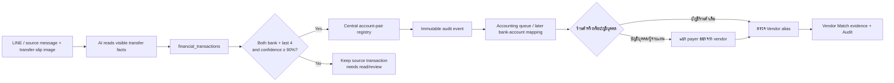

# Transfer Slip Account-Pair Registry Flow

## Purpose

Register a verified source-account → destination-account pair from every transfer slip without treating OCR as an accounting approval or storing a full bank account number.

## Inputs, outputs, states and permissions

- Input: `financial_transactions` transfer-slip fields: sender/recipient bank, masked account last-four, names, transfer time, reference and `payment_party_confidence`.
- Output: one `financial_transaction_account_pairs` row per source transaction, only when all four bank/account fields exist and confidence is at least `0.900`.
- The registry stores masked last-four digits only. It does **not** create a bank journal, change `review_status`, approve payment, or expose an account number.
- State: `auto_registered` for a qualified pair; an already registered pair becomes `needs_review` if a later correction makes it incomplete or lower confidence.
- Roles: the system trigger writes; company managers may read; direct client insert/update/delete is revoked. Accounting remains the owner of review and actual posting.
- Integration owner: LINE webhook / reprocess-transfer-slips supplies the facts; central registry trigger snapshots qualified pairs; Document Flow remains the source route and accounting queue.

## Failure, retry, audit and rollback

- Missing bank, missing last-four, confidence below 90%, a duplicate/dismissed transaction, or unreadable evidence creates no auto-registered pair. It stays eligible for the normal reprocess/Admin review route.
- Every registration/state change writes an append-only `financial_transaction_account_pair_audit` event. The underlying source slip, Intake ID and financial transaction are never replaced or deleted.
- Retry happens by correcting/reprocessing the original transaction; the trigger safely upserts the single registry row.
- The pair registry is not the Vendor Master. When the recipient account is a personal/employee account, Accounting records the payer separately and must create a Vendor Match from receipt/tax/project evidence before confirming a `vendor_payment` allocation. Name-only matches remain in the Accounting review queue.
- Rollback: disable the trigger/function and hide any registry status. Existing source transactions, pairs and audit remain available for traceability.

## Change record

| Version | Date | Rationale / impact | Migration | Verification | Rollback |
|---|---|---|---|---|---|
| v1.0 | 21/8/2569 | Automatically register high-confidence source/destination account pairs for each eligible transfer slip while keeping accounting approval separate | `20260821004635_transfer_slip_account_pair_registry.sql` | schema/RLS/trigger backfill count, lint/build/test and production page check | Disable trigger/UI; retain source, registry and audit |
| v1.1 | 21/8/2569 | Show the central registry as a dedicated tab in Financial Summary with masked source/destination pair, timestamp, confidence and status | No migration | production Financial Summary tab | Hide tab; registry/audit remains |
| v1.2 | 21/8/2569 | Separate sender, source bank/account, recipient, and destination bank/account in the registry table; add a row-detail drawer with transfer and registry audit timeline | No migration; reads existing registry/audit under RLS | lint/typecheck/test/build and authenticated production page inspection | Hide the drawer/restore compact columns; source, registry and audit remain |
| v1.3 | 26/8/2569 | Add payer-versus-vendor matching for personal-account payments without changing the masked account-pair registry | `20260826044252_transfer_slip_vendor_payment_matching.sql`, `20260826044610_revoke_transfer_slip_vendor_match_trigger_execute.sql` | vendor matching contract, typecheck/lint/build and Accounting Drawer smoke | Disable Vendor Match controls/trigger; preserve pair, lineage, source and Audit |
