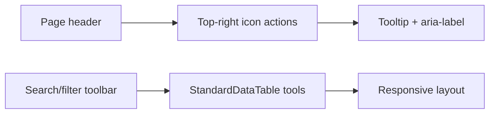

# UI Action Standard

กำหนดรูปแบบหน้าจอ ปุ่ม และไอคอนเป็นมาตรฐานกลางทั้งโปรแกรม โดยคงความหมายเดิมและไม่เปลี่ยนสิทธิ์หรือข้อมูลธุรกิจ

## Page layout contract

- ทุกหน้าต้องใช้ `PageHeader` เดียวกัน: ชื่อ/คำอธิบายด้านซ้าย และ action หลักเป็นไอคอนชิดขวาบน
- ไอคอนทุกตัวต้องมี Tooltip และ `aria-label`; action ที่เสี่ยงหรือมีข้อความยืนยันใช้ปุ่มข้อความ
- ตารางใช้ `StandardDataTable`; ค้นหา/กรอง/ตั้งค่าคอลัมน์/ส่งออกอยู่ในกลุ่ม action เดียว ไม่สร้างแถบเครื่องมือซ้ำ
- หน้าจอ responsive ต้องไม่ล้นแนวนอน และใช้ขนาดตัวอักษร/spacing จาก theme กลาง
- รายการคิวหรือรายการรองที่อยู่ใต้ตารางให้เปิด Drawer แบบสลิปเมื่อเลือก เพื่อดูสถานะ เอกสาร ข้อมูลที่ขาด และ action ต่อไป

## Rules

- Action หลักของหน้าอยู่มุมขวาบนใน `PageHeader`; ใช้ `IconButton` เมื่อความหมายสื่อได้ชัด และต้องมี Tooltip กับ `aria-label` เสมอ
- ใช้ไอคอนชุดเดียวกัน: เพิ่ม `AddOutlined`, รีเฟรช `RefreshOutlined`, จัดการสิทธิ์ `ManageAccountsOutlined`, ค้นหา/ตั้งค่า/ส่งออกใช้เครื่องมือของ `StandardDataTable`
- ปุ่มที่มีผลกระทบสูงหรือข้อความอาจกำกวมให้คงปุ่มข้อความไว้ ไม่ใช้ไอคอนอย่างเดียว
- ฟอร์มและตารางใช้ spacing, typography และสีจาก theme; มือถือจัด action เป็นแถวชิดขวาและไม่ให้ล้น viewport
- การกดซ้ำต้องถูกป้องกันด้วย disabled/loading หรือ idempotency ที่ชั้นข้อมูล และต้องคง Audit เดิม

## Roles, integrations, failure and owner

- ผู้ใช้เห็นเฉพาะ action ตาม role ที่ระบบอนุญาต; Tooltip/aria-label เป็น accessibility layer ไม่ใช่ permission gate
- การกด action เรียก service/RPC เดิม, เก็บ error ในหน้าเดิม และไม่เขียนข้อมูลเพิ่มหากการเรียกซ้ำ
- Module owner รับผิดชอบปรับหน้าเมื่อแก้ Flow; Design/UI owner รักษาเอกสารนี้และ registry

## Change record

| Version | Date | Scope | Verification | Rollback |
|---|---|---|---|---|
| 1.1 | 26/8/2569 | Employee page header and table actions use consistent top-right icon pattern; Filter and Search collapse into icon controls while Settings/CSV/PDF remain grouped in the same toolbar | typecheck, lint, build, authenticated page smoke | revert UI-only commit; no data migration |
| 1.2 | 26/8/2569 | Employee page removes the duplicate toolbar row; Filter, Search, Column settings, CSV and PDF actions are exposed from the PageHeader, with the search field opening on demand | typecheck, build; local page preview | revert UI-only change; no data migration |
