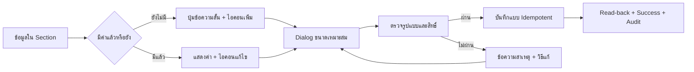

# UI Action Standard — มาตรฐานปุ่มเพิ่มและแก้ไขข้อมูล

## Page layout และ Table actions

- Action ระดับหน้าอยู่ขวาบนของ `PageHeader` และต้องมี Tooltip กับ `aria-label`
- ค้นหา กรอง ตั้งค่าคอลัมน์ CSV และ PDF ใช้เครื่องมือชุดเดียวกับ `StandardDataTable`; ห้ามสร้าง Toolbar ซ้ำอีกชั้น
- Action ที่มีผลกระทบสูงหรือความหมายกำกวมยังใช้ปุ่มข้อความและขั้นยืนยัน ไม่เปลี่ยนเป็นไอคอนล้วน
- มือถือต้องจัด Action เป็นแถวที่ไม่ล้น viewport และตารางต้องเปิดรายละเอียดจากแถว/Drawer ได้
- เริ่มบังคับใช้กับ `/employees` รอบ 26/8/2569 โดยไม่ลดสิทธิ์หรือเปลี่ยนข้อมูลธุรกิจ

## หลักการ

- ข้อมูลที่ยังไม่มี ใช้ปุ่มข้อความสั้นพร้อมไอคอน `+` เช่น `+ เพิ่มเบอร์โทร` เพื่อให้ความหมายชัดเจน
- ข้อมูลที่มีแล้ว แสดงค่าปัจจุบันและใช้ไอคอนดินสอขนาดเล็กด้านขวา พร้อม Tooltip และ `aria-label`
- รายการที่เพิ่มได้หลายค่า เช่น LINE ใช้ปุ่มข้อความขนาดเล็ก `+ เพิ่ม LINE อีกบัญชี`; แต่ละรายการมี Action ของตัวเอง
- หลีกเลี่ยงไอคอนล้วนสำหรับ Action ใหม่หรือความหมายเฉพาะงาน ถ้าผู้ใช้อาจต้องเดา
- Primary Action มีหนึ่งรายการต่อ Dialog; Action รองใช้ text/outlined และต้องไม่แย่งลำดับสายตา
- ข้อมูลลับ เช่น เลขบัญชีเต็ม ต้องแยก Secure Store; Action เปิดดูต้องขอเหตุผล, จำกัดสิทธิ์, ซ่อนอัตโนมัติ และบันทึก Audit โดยห้ามใส่ค่าลับใน Log

## Contract

| หัวข้อ | มาตรฐาน |
| --- | --- |
| Input | ค่าปัจจุบัน, ผู้ใช้/บริษัท, สิทธิ์ และเหตุผลการแก้ไข |
| Output | ค่าที่บันทึกจริง, read-back, ข้อความสำเร็จ/ไม่สำเร็จ และ Audit |
| State | empty → editing → validating → saving → saved/unchanged/error |
| Roles | ซ่อนหรือปิด Action เมื่อไม่มีสิทธิ์; Backend/RPC ต้องตรวจสิทธิ์ซ้ำ |
| Integration | UI เรียก service/RPC ที่ company-scoped; ห้ามพึ่ง UI validation อย่างเดียว |
| Failure/Retry | แสดงสาเหตุและวิธีแก้, ปลดล็อกให้ลองใหม่, กดซ้ำต้องไม่สร้าง Audit/Version ซ้ำ |
| Audit | ข้อมูลสำคัญต้องมี actor, company, entity, before/after, reason, source และเวลา |
| Owner | Design System Owner กำหนด Pattern; Module Owner รับผิดชอบ validation และข้อมูลปลายทาง |

## Responsive contract

- ช่วงหน้าจอ 320–768px ใช้ mobile navigation แบบ Drawer ที่นำรายการเดียวกับ Sidebar Desktop และกรองด้วย role/platform permission เดิม ห้ามซ่อน action สำคัญเพียงเพราะเป็นมือถือ
- Drawer และ Dialog บนมือถือใช้พื้นที่เต็ม viewport พร้อมปุ่มปิดที่เข้าถึงได้ และใช้ state ของหน้าเดิมเพื่อรักษาค่าฟอร์มระหว่างเปิดคีย์บอร์ดหรือหมุนจอ
- ตารางใช้ `StandardDataTable` และคงคอลัมน์/สิทธิ์/การ export เดิม; เมื่อกว้างเกิน viewport ให้เลื่อนแนวนอนบน touch screen พร้อมข้อความแนะนำ ไม่ตัดข้อมูลสำคัญ
- ปุ่มและ icon action มี touch target อย่างน้อย 44px บนมือถือ; loading/disabled และ error/success/empty/retry ต้องยังแสดงในเส้นทางเดิม
- TopBar ต้องแสดงบริษัท ผู้ใช้ และ role บนมือถือ; Project ที่เป็น context ของหน้าให้แสดงใน PageHeader หรือ filter ของ module นั้น โดยไม่ขยาย query ข้าม company/project

## วิธีนำไปใช้

เริ่มใช้กับ Employee Drawer v3.0 สำหรับเบอร์โทรและหลายบัญชี LINE ส่วนหน้าที่มีอยู่เดิมไม่ต้องแก้พร้อมกันทั้งหมด แต่เมื่อมีการแก้หน้าหรือ Flow นั้นครั้งถัดไป ต้องนำ Action ที่เกี่ยวข้องเข้าสู่มาตรฐานนี้ และบันทึกไว้ใน Flow document ของโมดูล

## Change record

| Version | Date | Rationale | Impact | Migration | Verification | Rollback |
| --- | --- | --- | --- | --- | --- | --- |
| v1.0 | 26/8/2569 | ให้ Action เพิ่ม/แก้ไขใช้ภาษาและลำดับเดียวกันทั้งระบบโดยไม่บังคับ Big-bang rewrite | เริ่มที่ `/employees`; legacy Profile สร้าง/เชื่อม contact projection เมื่อบันทึก; โมดูลอื่นปรับเมื่อมีการแก้ครั้งถัดไป | `20260826200000_employee_phone_admin_update.sql`, `20260826210000_employee_phone_legacy_profile_bridge.sql` | contract, permission/idempotency/Audit/legacy bridge, typecheck, lint, build และ authenticated Drawer smoke | revert UI/RPC; ค่า phone, projection และ Audit ที่บันทึกแล้วคงอยู่ |
| v1.1 | 26/8/2569 | เพิ่ม Pattern สำหรับข้อมูลลับที่ต้องใช้งานจริง แต่ห้ามเผยใน UI/Log ปกติ | Employee bank account Secure Store และ Action เพิ่ม/แก้ไข/เปิดดู | `20260826203000_employee_bank_account_secure_store.sql`, `20260826204500_employee_bank_secret_audit_fk_indexes.sql` | encryption/fingerprint/privilege/Audit contracts, FK advisor, tests, typecheck, lint, build และ authenticated smoke | ซ่อน Action/revoke RPC; ciphertext และ Audit คงไว้เพื่อ recovery |
| v1.2 | 26/8/2569 | ข้อมูลที่ระบบมี Candidate อยู่แล้วต้องเสนอให้เลือกก่อนกรอกใหม่ โดยไม่ Auto-link | Employee bank account Candidate selection; แสดงเลขท้าย Source และ readiness | `20260825233255_employee_bank_candidate_link.sql` | candidate/link/permission/idempotency/Audit contracts และ Employee Drawer smoke | ซ่อน Candidate selector; Manual Secure Entry และข้อมูลเดิมยังใช้ได้ |
| v1.3 | 26/8/2569 | Employee page header and table actions use consistent top-right icon pattern | Filter/Search collapse into icon controls while Settings/CSV/PDF remain grouped in the same toolbar | None | typecheck, lint, build, authenticated page smoke | revert UI-only change; no data migration |
| v1.4 | 26/8/2569 | Remove the duplicate Employee toolbar row | Filter, Search, column settings, CSV and PDF remain exposed from PageHeader | None | typecheck, build and local page preview | revert UI-only change; no data migration |
| v1.5 | 4/9/2569 | Add shared mobile navigation Drawer, viewport-sized mobile Dialog/Drawer behavior, 44px touch targets, and explicit horizontal-table guidance | shared layout/theme/table UI only; permissions and data scope are unchanged | None | mobile responsive contract, targeted lint/typecheck, build, Android/iPhone and desktop smoke | revert shared layout/theme/table UI changes; no data migration |
