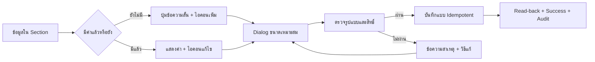

# UI Action Standard — มาตรฐานปุ่มเพิ่มและแก้ไขข้อมูล

## หลักการ

- ข้อมูลที่ยังไม่มี ใช้ปุ่มข้อความสั้นพร้อมไอคอน `+` เช่น `+ เพิ่มเบอร์โทร` เพื่อให้ความหมายชัดเจน
- ข้อมูลที่มีแล้ว แสดงค่าปัจจุบันและใช้ไอคอนดินสอขนาดเล็กด้านขวา พร้อม Tooltip และ `aria-label`
- รายการที่เพิ่มได้หลายค่า เช่น LINE ใช้ปุ่มข้อความขนาดเล็ก `+ เพิ่ม LINE อีกบัญชี`; แต่ละรายการมี Action ของตัวเอง
- หลีกเลี่ยงไอคอนล้วนสำหรับ Action ใหม่หรือความหมายเฉพาะงาน ถ้าผู้ใช้อาจต้องเดา
- Primary Action มีหนึ่งรายการต่อ Dialog; Action รองใช้ text/outlined และต้องไม่แย่งลำดับสายตา
- ข้อมูลลับ เช่น เลขบัญชีเต็ม ต้องแยก Secure Store; Action เปิดดูต้องขอเหตุผล, จำกัดสิทธิ์, ซ่อนอัตโนมัติ และบันทึก Audit โดยห้ามใส่ค่าลับใน Log

## Contract

| หัวข้อ | มาตรฐาน |
| --- | --- |
| Input | ค่าปัจจุบัน, ผู้ใช้/บริษัท, สิทธิ์ และเหตุผลการแก้ไข |
| Output | ค่าที่บันทึกจริง, read-back, ข้อความสำเร็จ/ไม่สำเร็จ และ Audit |
| State | empty → editing → validating → saving → saved/unchanged/error |
| Roles | ซ่อนหรือปิด Action เมื่อไม่มีสิทธิ์; Backend/RPC ต้องตรวจสิทธิ์ซ้ำ |
| Integration | UI เรียก service/RPC ที่ company-scoped; ห้ามพึ่ง UI validation อย่างเดียว |
| Failure/Retry | แสดงสาเหตุและวิธีแก้, ปลดล็อกให้ลองใหม่, กดซ้ำต้องไม่สร้าง Audit/Version ซ้ำ |
| Audit | ข้อมูลสำคัญต้องมี actor, company, entity, before/after, reason, source และเวลา |
| Owner | Design System Owner กำหนด Pattern; Module Owner รับผิดชอบ validation และข้อมูลปลายทาง |

## วิธีนำไปใช้

เริ่มใช้กับ Employee Drawer v3.0 สำหรับเบอร์โทรและหลายบัญชี LINE ส่วนหน้าที่มีอยู่เดิมไม่ต้องแก้พร้อมกันทั้งหมด แต่เมื่อมีการแก้หน้าหรือ Flow นั้นครั้งถัดไป ต้องนำ Action ที่เกี่ยวข้องเข้าสู่มาตรฐานนี้ และบันทึกไว้ใน Flow document ของโมดูล

## Change record

| Version | Date | Rationale | Impact | Migration | Verification | Rollback |
| --- | --- | --- | --- | --- | --- | --- |
| v1.0 | 26/8/2569 | ให้ Action เพิ่ม/แก้ไขใช้ภาษาและลำดับเดียวกันทั้งระบบโดยไม่บังคับ Big-bang rewrite | เริ่มที่ `/employees`; โมดูลอื่นปรับเมื่อมีการแก้ครั้งถัดไป | `20260826200000_employee_phone_admin_update.sql` เฉพาะ Employee phone | contract, permission/idempotency/Audit, typecheck, lint, build และ authenticated Drawer smoke | revert UI/RPC; ค่า phone และ Audit ที่บันทึกแล้วคงอยู่ |
| v1.1 | 26/8/2569 | เพิ่ม Pattern สำหรับข้อมูลลับที่ต้องใช้งานจริง แต่ห้ามเผยใน UI/Log ปกติ | Employee bank account Secure Store และ Action เพิ่ม/แก้ไข/เปิดดู | `20260826203000_employee_bank_account_secure_store.sql`, `20260826204500_employee_bank_secret_audit_fk_indexes.sql` | encryption/fingerprint/privilege/Audit contracts, FK advisor, tests, typecheck, lint, build และ authenticated smoke | ซ่อน Action/revoke RPC; ciphertext และ Audit คงไว้เพื่อ recovery |
