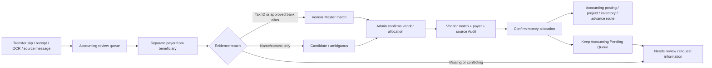

# Vendor Payment Matching Flow

## Purpose

Record a payment made from a personal or employee-held bank account without mistaking the payer for the store/vendor that actually received the money. The payer remains a money-lineage fact; the vendor is an allocation fact backed by the receipt, tax ID, bank alias, project and source evidence.

## Inputs and outputs

- Inputs: transfer slip, receipt/invoice, OCR, source message/room, sender/recipient bank and masked account tail, project/site context and existing Vendor Master.
- Output: a vendor match row keyed by `lineage_id + allocation_key`, an optional confirmed bank-account alias, and an append-only `document_flow_events` audit event. Raw/OCR/source rows are never overwritten.
- A single slip may have multiple allocations. Each `vendor_payment` allocation must have its own vendor match; a personal payer may be the same person across many vendors.

## Matching policy

1. Exact tax ID is strongest evidence.
2. A bank name + account tail is accepted only after an Admin-confirmed alias exists; it is never inferred from a person name.
3. Receipt/vendor name and project/site context produce a candidate, not an automatic confirmation.
4. Multiple close candidates, missing evidence, duplicate/system context or conflicting sender/recipient facts remain `ambiguous`/`needs_review` in Accounting.
5. Confirmation requires a Vendor Master ID, `match_status=matched`, a reason and source evidence. The database trigger rejects a confirmed vendor allocation without that row.

## States, roles and recovery

- `needs_review`/`candidate` → Admin selects Vendor Master and records evidence → `matched` → Accounting confirms the money allocation.
- Accounting Admin/Manager can review and write through the security-definer RPC; normal users read only rows permitted by company/accounting RLS.
- The two-phase UI save is intentionally recoverable: a draft and vendor evidence may exist while final confirmation is pending; retry reuses the lineage/allocation identity and a new event key. A failed final confirmation leaves the item in Accounting review and does not close the job.
- Vendor bank aliases are append-only reusable evidence. A later mismatch changes the match row/version and creates a new Audit event; it does not delete the original source.

## Data and audit

`transfer_slip_vendor_matches` stores vendor, payer, masked bank/account, confidence, reason, evidence, source item/message, reviewer and version. `vendor_bank_account_aliases` stores only confirmed company-scoped aliases. `document_flow_events` stores before/after payload, actor, route and event key for idempotency.

## Verification and rollback

- Local contract covers exact-tax match, name-only candidate, ambiguous candidates, missing evidence and idempotent event keys; typecheck/lint/build and Accounting Drawer smoke are required.
- Migrations `20260826044252_transfer_slip_vendor_payment_matching.sql` and `20260826044610_revoke_transfer_slip_vendor_match_trigger_execute.sql` are additive, company-scoped and do not touch Raw/OCR. Rollback is to disable the new Vendor Payment fields/trigger/RPC and hide the controls; existing lineage, source and Audit remain available.

## Change record

| Version | Date | Rationale | Impact | Migration | Verification | Rollback |
| --- | --- | --- | --- | --- | --- | --- |
| v1.0 | 26/8/2569 | Separate employee/personal payer from the actual vendor and stop name-only routing | Accounting transfer-slip Drawer, vendor match evidence, reusable bank aliases and confirmation gate | `20260826044252_transfer_slip_vendor_payment_matching.sql`, `20260826044610_revoke_transfer_slip_vendor_match_trigger_execute.sql` | matching contract, schema/RLS review, typecheck/lint/build and authenticated Accounting smoke | Disable trigger/RPC/UI; retain all source, lineage, match and Audit rows |
