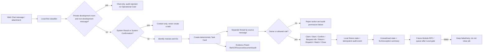

# Web Chat Operational Core

## Purpose

Operational Core is the shared work layer displayed above ordinary Web Chat messages. It creates a compact Task Card only for important business/development messages, keeps one thread per source message, exposes evidence and audit context, and offers the same action vocabulary across modules. It is a local-first projection in this release: actions update an in-memory fixture only and do not write Supabase, Storage, attendance, advance, HR, or production data.

## Inputs and outputs

- Input: a room's `chat_messages` projection, sender/profile, `message_class`, attachment metadata, IDs in text, and optional `OCR:`, `Source:`, or `Document ID` markers.
- Output: a deterministic `TASK-xxxxxxxx` card with `thread:<source_message_id>`, module, owner, status, next action, due/SLA, linked Advance/Document/Attendance IDs, Evidence Panel, unread state, exception state, and audit timeline.
- System Confirmation/System Result remains visible as context but never creates a new task or business transaction.
- `program_development_primary` is an owner-only command inbox. Non-development messages remain visible in Chat and are audited as rejected, but do not create an Operational Core card or pending count.

## States and actions

Cards start at `received`, `in_progress`, `waiting_review`, `completed`, `blocked`, `duplicate`, or `failed` based on the source evidence. Standard actions are Claim (รับงาน), Start (เริ่มทำ), Confirm (ยืนยัน), Request information (ขอข้อมูล), Return (ส่งกลับ), Dispatch (ส่งต่อ), Match (จับคู่), Close (ปิดงาน), and View result (ดูผลลัพธ์). Every action has a deterministic event key and repeated events are no-ops.

## Roles and permissions

The source owner may act on their card. Admin, company admin, executive, manager, and owner roles may coordinate any card. A module-specific RPC/role must replace this local rule before Production actions are enabled. Unauthorized actions are rejected and remain in the audit explanation; a closed card cannot be changed by a second close.

## Evidence, notification, and SLA

The Evidence Panel shows attachment kind/name, OCR text, source reference, Document ID, and source-message audit. Cards carry unread/read state and a due time from a module SLA (HR/Attendance 30 minutes, Finance/Advance 120 minutes, Development 24 hours, General 4 hours). The daily summary counts received, forwarded, pending, closed, duplicate, failed, unread, and SLA breaches. Exceptions remain visible until a valid action or retry resolves them.

## Integrations and failure/retry

The current layer reads the existing Chat message stream and reuses the existing HR, attendance, advance, document, and Program Development flows without changing their business transitions. Future integration must call the responsible Module RPC/queue only after Local-first verification. Delivery or RPC failure stays `failed`/`blocked`, increments retry state in the owning module, and never closes a Job or silently falls back to another room. Duplicate source messages retain their thread and do not create a second task.

## Audit and owner

Every local task and action has an audit event key, actor, timestamp, and transition detail. The Chat/Operational Core owner is the system team; the business owner remains the responsible HR, Attendance, Finance, Advance, or Development role. Production migration, queue wiring, and Cloudflare runtime smoke are explicitly deferred until the local gate passes.

## Change record

- Version: v1.0
- Date: 23/08/2569
- Rationale: give Web Chat one consistent operational work surface without mixing unrelated messages or allowing System Result loops.
- Impact: local-first service, Chat UI Task Cards, Evidence Panel, action vocabulary, read/SLA summaries, and local contract test; no schema or production data change.
- Migration: none in this release.
- Verification: `npm run test:web-chat-operational-core`, typecheck, lint, build, existing Chat/Program Development tests; Cloudflare runtime smoke is pending after local gate.
- Rollback: remove the Operational Core panel/service and keep existing Chat, HR, attendance, advance, and development flows unchanged. No data rollback is required.

- Version: v1.1
- Date: 24/08/2569
- Rationale: prevent business messages appearing in the private Program Development room from becoming misleading Operational Core work.
- Impact: development-room classification now drops non-development Operational Cards; the room renders Command Inbox only. Messages, business data, and existing task/audit records are not mutated.
- Migration: none.
- Verification: `npm run test:web-chat-operational-core`, `npm run test:program-development-room`, typecheck, lint, build, and authenticated Cloudflare Chat smoke.
- Rollback: revert the classifier/UI change; no data rollback is required because this is a projection-only filter.

