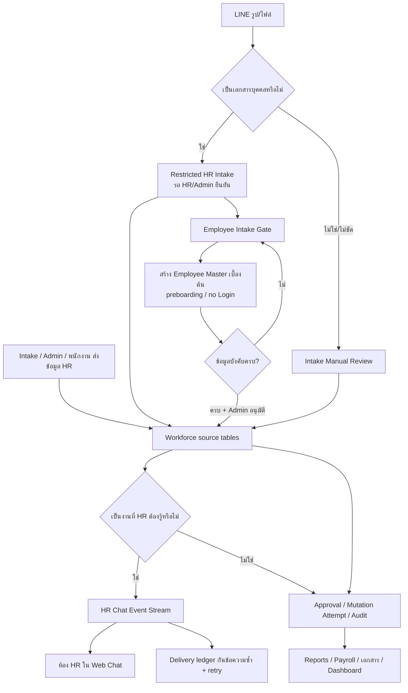
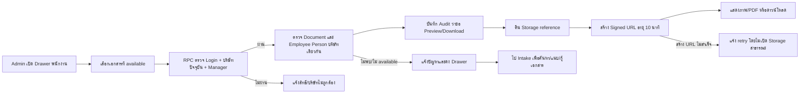
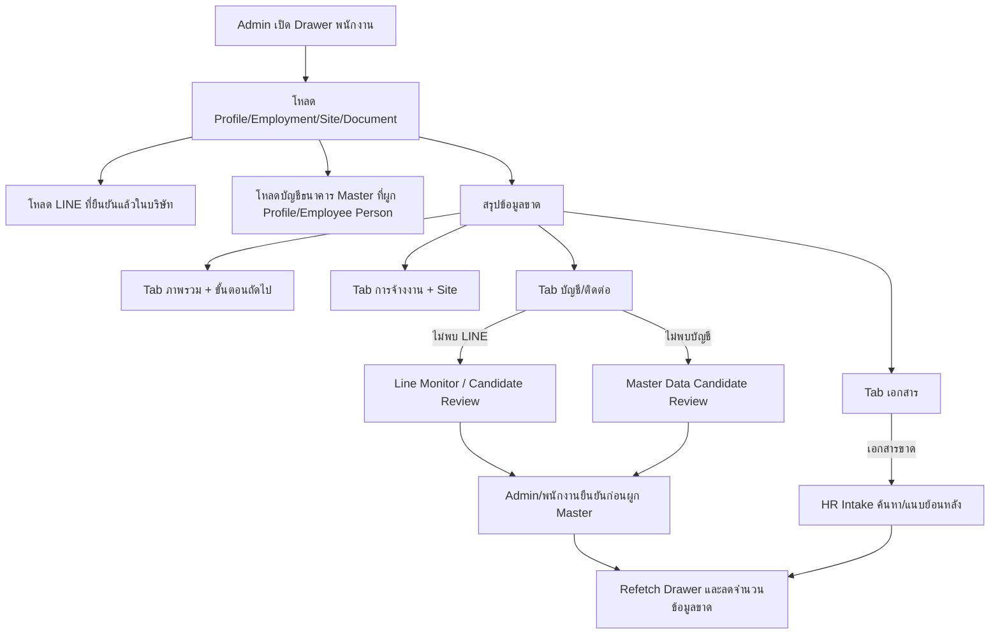
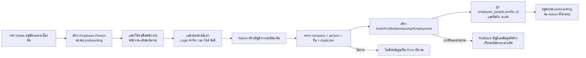
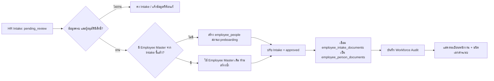
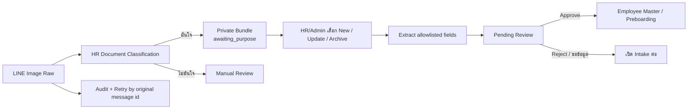
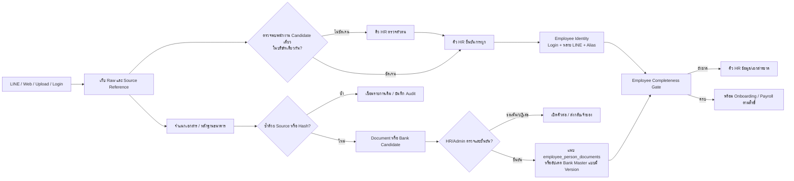
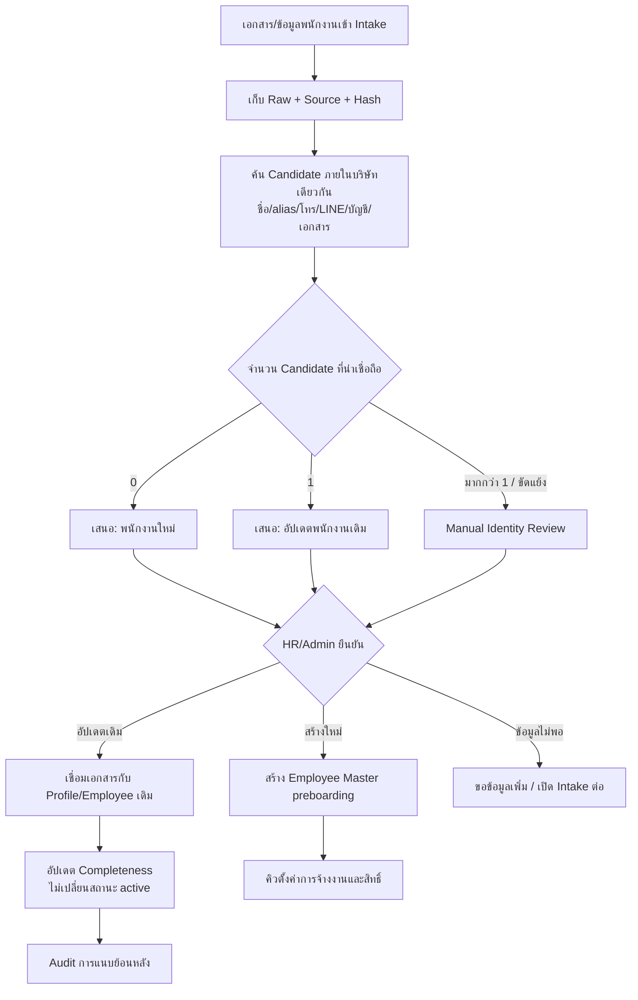
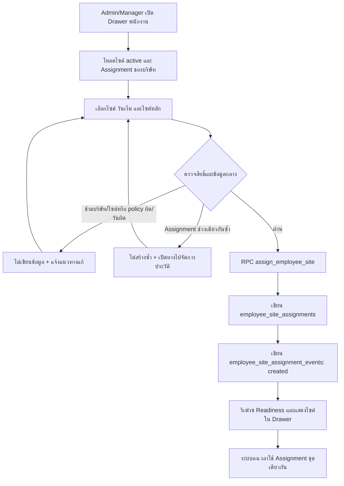
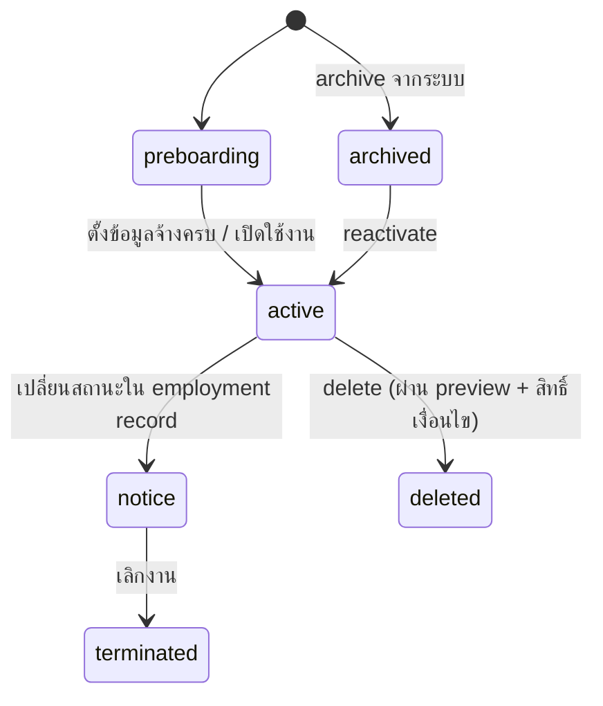

# WORKFORCE FLOW — แกนหลังระบบงานบุคคล



## Secure Employee Document Viewer v2.6 — 26/8/2569



- **Input:** `employee_person_documents.id` จาก Drawer, action `preview/download`, ผู้ใช้และบริษัทที่กำลังใช้งาน
- **Output/State:** Signed URL ของ private Storage อายุ 600 วินาที; ไม่มีการเปลี่ยนสถานะเอกสารหรือ Employee Master
- **Role/Permission:** Platform Admin หรือ Company Manager ของบริษัทปัจจุบันเท่านั้น; RPC ตรวจ tenant ซ้ำก่อนคืน storage reference และ Storage RLS ยังเป็นด่านสุดท้าย
- **Integration:** Employee Drawer → `request_employee_document_access` → Workforce Audit → Supabase private Storage; ลิงก์ recovery ไป HR Intake
- **Failure/Retry:** ไม่พบไฟล์/ไม่ available/ผิดบริษัท/ไม่มีสิทธิ์จะไม่คืน path; signed URL ล้มเหลวแจ้งชัดและ retry ได้; เอกสารขาดให้ค้นหา/แนบจาก Intake โดยไม่สร้าง Employee ซ้ำ
- **Audit/Idempotency:** ทุกคำขอเปิดดู/ดาวน์โหลดบันทึก `employee_document_preview_requested` หรือ `employee_document_download_requested`; การขอซ้ำสร้าง Audit ใหม่ตามเหตุการณ์ แต่ไม่สร้าง Document link ใหม่
- **Owner:** HR/Admin เป็นผู้ใช้และแก้ความไม่ครบ; Workforce Module เป็นเจ้าของ permission/audit; Document Intake เป็นเจ้าของไฟล์ต้นฉบับและ recovery

### Change record

| Version | Date | Rationale | Impact | Migration | Verification | Rollback |
| --- | --- | --- | --- | --- | --- | --- |
| v2.6 | 26/8/2569 | ให้เอกสารใน Drawer เปิดตรวจได้จริงโดยไม่เผย bucket/path หรือทำ Storage เป็น public | `/employees`, Workforce Audit, private Storage signed URL และ Intake recovery | `20260826000100_employee_document_secure_preview.sql` | contract, migration dry-run/apply, RLS/RPC check, typecheck, lint, build และ authenticated Drawer preview/Audit smoke | revert UI/RPC และ revoke function; เอกสาร/Raw/link เดิมไม่เปลี่ยน และ Audit ที่เกิดแล้วคงไว้ |

## Employee Drawer Information Hub v2.7 — 26/8/2569



- **Input:** Profile, Employment, active Site Assignment, Employee Person/Document, company-scoped LINE Account และ verified Bank Master
- **Output/State:** Drawer 4 แท็บพร้อมจำนวนข้อมูลขาดและ Next Action; เป็น projection อ่านข้อมูลจริง ไม่มีการ auto-link หรือแก้ Master จากการเปิดหน้า
- **Role/Permission:** ใช้ RLS เดิมของบริษัท; Manager เห็นข้อมูลบริษัทปัจจุบันเท่านั้น; LINE และบัญชีธนาคารที่ยังไม่ยืนยันไม่ถูกแสดงเป็นข้อเท็จจริงของพนักงาน
- **Integration:** Employee → LINE Monitor/Account Link, Master Data Center, HR Intake, Workforce Setup และ Reports
- **Failure/Retry:** query ใดล้มเหลวให้แจ้งโหลดข้อมูลพนักงานไม่สำเร็จและไม่แสดงว่า “ครบ”; Candidate คลุมเครือคงรอตรวจ ห้ามเดาจากชื่อ; refetch หลังยืนยันเพื่อแสดงสถานะจริง
- **Audit/Idempotency:** Drawer เป็น read-only projection; การผูก LINE/Bank/Document ใช้ Flow ปลายทางและ Audit/idempotency ของแต่ละระบบ
- **Owner:** HR/Admin จัดการข้อมูลขาด; LINE Monitor, Master Data และ Intake เป็นเจ้าของการยืนยันข้อมูลต้นทาง; Workforce เป็นเจ้าของสรุปความพร้อม

### Change record

| Version | Date | Rationale | Impact | Migration | Verification | Rollback |
| --- | --- | --- | --- | --- | --- | --- |
| v2.7 | 26/8/2569 | Drawer ยาวและไม่เห็น LINE/บัญชีธนาคาร ทำให้ Admin ไม่รู้ว่าข้อมูลใดพร้อมหรือยังขาด | `/employees` แบ่ง 4 Tabs, อ่าน LINE/Bank company-scoped, สรุป missing และลิงก์ไป Flow เจ้าของข้อมูล | ไม่มี schema migration | contract, tenant tests, typecheck, lint, build และ authenticated Production smoke ครบ 4 Tabs | revert UI/query; LINE/Bank/Document/Employment Master และ Audit ไม่เปลี่ยน |

## Employee Preboarding Visible List v2.4 — 25/8/2569



- **Input:** Employee Person จาก Intake ที่มีเอกสารและสถานะ `preboarding`; Admin ระบุอีเมล รหัสผ่านชั่วคราว และสิทธิ์บัญชี
- **Output/State:** รายการแสดงในกลุ่ม “พนักงานเตรียมเริ่มงาน” พร้อมช่องขาดสีแดง; หลังสร้างบัญชีจะผูกกับทะเบียนเดิมและยังเป็น `preboarding` ไม่เปิดการลงเวลา/ค่าแรงโดยอัตโนมัติ
- **Role/Permission:** เฉพาะ Platform Admin หรือ Company Admin/Executive/Manager ในบริษัทเดียวกัน; service role ใช้ภายใน Edge Function เท่านั้น
- **Integration:** Supabase Auth, profiles, company_members, user_company_preferences, employee_employment_records และ employee_people
- **Failure/Retry:** ตรวจทะเบียนถูกบริษัท ยังไม่ถูกผูก และชื่อเดียวกันก่อนเขียน; หากขั้นตอนใดล้มเหลวให้ลบข้อมูลบัญชีที่สร้างในรอบนั้น แต่เก็บ Intake/Employee Person/Document เดิมเพื่อ retry
- **Audit/Idempotency:** `employee_people.profile_id is null` เป็น linking gate; บันทึก `employee_preboarding_account_linked`; กดซ้ำตอบ conflict และไม่สร้างบัญชีซ้ำ
- **Owner:** HR/Admin เป็นผู้เติมและยืนยันข้อมูล; Workforce Module เป็นเจ้าของ validation, linking, rollback และ Audit

### Change record

| Version | Date | Rationale | Impact | Migration | Verification | Rollback |
| --- | --- | --- | --- | --- | --- | --- |
| v2.4 | 25/8/2569 | ให้ทะเบียนพนักงานเบื้องต้นปรากฏร่วมกับงานพนักงานและชี้ข้อมูลที่ Admin ต้องเติม โดยไม่สร้างบุคคลซ้ำ | `/employees`, `create-employee`, Auth/Profile/Membership/Employment linking และ Workforce Audit | ไม่มี schema migration | contract test, typecheck, lint, build, dry-run, authenticated Production smoke และตรวจ person/profile/audit | revert UI/Edge commit; บัญชีที่สร้างแล้วใช้ recovery ตาม Audit โดยไม่ลบ Intake/Document ต้นฉบับ |
| v2.4.1 | 25/8/2569 | ป้องกันทะเบียนที่ผูกบัญชีสำเร็จแล้วค้างในรายการและเสนอปุ่มสร้างบัญชีซ้ำ | `/employees` กรองกลุ่มเตรียมเริ่มงานด้วย `profile_id is null`; พนักงานที่ผูกแล้วอยู่ตารางหลักเพียงจุดเดียว | ไม่มี | contract, typecheck, lint, build และ authenticated Production smoke หลังสร้างบัญชี | revert UI query ได้โดยไม่กระทบข้อมูลหรือ Audit |
| v2.5 | 25/8/2569 | เพิ่มการมอบหมายไซต์จาก Drawer พนักงานด้วยข้อมูลชุดเดียวกับระบบลงเวลา | Drawer → canonical `assign_employee_site`; ตรวจบริษัท/สิทธิ์/ไซต์/policy/ช่วงวัน/รายการซ้ำ และบันทึก event แบบ immutable | `20260825231500_employee_drawer_site_assignment_audit.sql` | contract, typecheck, lint, build, migration dry-run/apply และ authenticated Drawer smoke | ซ่อนส่วน Drawer และคืน RPC ก่อนหน้า; assignment/event ที่สร้างแล้วคงไว้เพื่อตรวจสอบ |
| v2.5.1 | 25/8/2569 | ป้องกันการกดมอบหมายไซต์เดิมซ้ำจาก Drawer หลังบันทึกสำเร็จ | กรองไซต์ active ที่มอบหมายแล้วออกจากตัวเลือก, reset ฟอร์มทุกครั้งที่เปิด Drawer และซ่อนปุ่มเมื่อไม่มีไซต์เหลือ | ไม่มี | contract, typecheck, lint, build และ authenticated Drawer smoke กับพนักงานที่มี Assignment แล้ว | คืน UI filter ได้; duplicate gate ใน RPC และข้อมูลเดิมไม่เปลี่ยน |

## Employee Master ก่อนข้อมูลครบ — v1.1 (25/8/2569)

- เอกสารจาก Intake สามารถสร้างตัวตนพนักงานระดับ `preboarding` เพื่อให้ HR เริ่มจัดแฟ้มและตามข้อมูลได้ โดยไม่สร้าง `profiles`, `company_members`, การมอบหมายไซต์ หรือข้อมูลค่าแรง
- เอกสารทุกใบเชื่อมผ่าน `employee_person_documents`; กดซ้ำไม่สร้างแถวซ้ำ และยังย้อนกลับไปยัง Intake/ไฟล์ต้นฉบับได้
- ประเภทการจ้าง `unknown` ใช้ได้เฉพาะ Employee Master ขั้นต้น; ก่อนอนุมัติ Intake ต้องเป็น daily/monthly/temporary/contractor และข้อมูลบังคับต้องครบ
- การเปิดใช้งานจริงยังต้องผ่าน Onboarding Readiness และ action แยก จึงไม่ทำให้บุคคลที่ข้อมูลไม่ครบลงเวลา/เข้าระบบ/คำนวณค่าแรงโดยอัตโนมัติ
- Rollback: ปิด action/RPC และ archive Employee Master ที่สร้างผิดโดยคงเอกสารและ Audit; ไม่ reset/drop และไม่ลบ Raw Intake

## วัตถุประสงค์
เอกสารนี้เป็น **แกนหลัง (backbone)** ของระบบงานบุคคลในโปรเจกต์:
- บอกว่า “ข้อมูลอะไรเกิดขึ้นและอยู่ที่ไหน”
- บอกเส้นทางธุรกิจหลักแบบ End-to-End
- ทำให้ทีมเห็นจุดรออนุมัติ/จุดควบคุม/จุดคงที่ที่ต้องมี audit

---

## โครงข้อมูลหลัก (Data Backbone)

### 1) ข้อมูลบุคคลและสิทธิ์
- `profiles`
  - ข้อมูลผู้ใช้/พนักงานพื้นฐาน (`full_name`, `email`, `role`)
- `company_members`
  - ผูก `profile` กับ `company`
  - กำหนดสิทธิ์ (`company_role`) และสถานะ active/หมดอายุ
- `user_company_preferences`
  - ระบุ `active_company_id` ที่ผู้ใช้กำลังใช้งาน
- `company_member_type_audit`
  - เก็บประวัติการเปลี่ยนประเภทสมาชิก

### 2) ข้อมูลการจ้างและความพร้อม
- `employee_employment_records`
  - รหัสพนักงาน, ประเภทการจ้าง, สถานะ, อัตราค่าจ้าง, OT rate, policy ของพนักงาน
- `employee_onboarding_readiness` (view)
  - สถานะ readiness ของพนักงานต่อการ clock-in: มีชื่อ/ข้อมูลจ้าง/อัตรา/นโยบาย/ไซต์ครบหรือไม่
- `attendance_policies`, `work_policies`
  - กำหนดกติกาเวลา-OT/ความยืดหยุ่น

### 3) การลงงานและความพร้อมปฏิบัติ
- `project_sites`
  - ข้อมูลไซต์งาน + policy ตั้งต้นของไซต์
- `employee_site_assignments`
  - ประวัติการมอบหมายพนักงานต่อไซต์ (หลัก/เสริม, ช่วงเวลามีผล, policy เฉพาะ)
- `employee_overtime_assignments`
  - คำขอ/รายการ OT รายบุคคล
- `attendance_sessions`
  - บันทึกเวลาเข้าออกจริง
- `attendance_correction_requests`
  - คำขอตรวจแก้บันทึกเวลา
- `app_activity_logs`, `user_app_status`
  - ใช้สำหรับ audit ภาพรวมการใช้งานของระบบบุคคล

### 4) คำขอด้านบุคลากร
- `employee_leave_types`
  - ประเภทการลา
- `employee_leave_requests`
  - คำขอลา, สถานะ, เหตุผล, ช่วงเวลา
  - กรณีพนักงาน/ช่างโทรแจ้งหรือแจ้งนอกระบบ ให้ Admin บันทึก Manual จากหน้า Reports Tap “ขาด–ลา–สาย” เป็นรายการ `approved` พร้อมเหตุผลและผู้ตรวจ
- `employee_document_requests`
  - คำขอเอกสาร (เช่น payslip, หนังสือรับรองรายได้, สรุปงาน)
- `employee_leave_balances`
  - สรุปสิทธิ์/การใช้สิทธิ์ลา

### 5) ค่าจ้างและการชำระ
- `pay_cycle_settings`
  - กำหนดรอบเงินเดือน
- `pay_periods`
  - รอบจ่ายค่าจ้าง (start/end/pay date/status)
- `employee_payrolls`
  - สถานะค่าจ้างรายบุคคล (`estimated`, `needs_review`, `approved`, ...)
- `employee_payslips`
  - เอกสารสลิปสำหรับพนักงาน

### 6) Edge Functions / RPC ที่เป็นควบคุม
- Edge: `create-employee`
  - สร้าง Auth user + profile + membership + employment + preferences
- Edge: `manage-employee`
  - archive/reactivate/delete/resign พนักงาน + ผูกกติกาการอนุมัติ
- `employee_delete_preview` (rpc)
  - เช็กได้/ไม่ได้ก่อนลบ
- `set_employee_active` (rpc)
  - เปลี่ยนสถานะพนักงาน
- `assign_employee_site` / `manage_employee_site_assignment` (rpc)
  - มอบหมายและจัดการประวัติ site assignment อย่าง audit-safe
- `review_leave_request`, `cancel_leave_request`, `review_overtime_assignment`, `acknowledge_overtime_assignment`
- `review_document_request`, `transition_document_request`
- `generate_pay_period`, `transition_employee_payroll`
- `ensure_semimonthly_pay_periods`

---

## แกนหลัง Flow (End-to-End)

```mermaid
flowchart TD
  A[1) Onboarding พนักงาน] --> B[create-employee]
  B --> C{สร้างสำเร็จหรือไม่}
  C -->|สำเร็จ| D[employee_employment_records = preboarding]
  C -->|ไม่สำเร็จ| C1[คืน error code + แนวทางซ่อม]

  D --> E[2) ตั้งค่า Workforce Setup]
  E --> E1[กำหนด work_policies]
  E --> E2[ผูกนโยบายเข้าซีสต์งาน/ไซต์]
  E --> E3[มอบหมายพนักงานไซต์ (assign_employee_site)]
  E --> E4[ตั้งกฎเงินเดือน/การจ่าย]

  E1 --> F[3) ตรวจ readiness]
  E2 --> F
  E3 --> F
  E4 --> F
  F --> F1{employee_onboarding_readiness}
  F1 -->|ไม่พร้อม| F2[แจ้งงานขาด: ชื่อ/จ้าง/อัตรา/โอที/ไซต์/นโยบาย]
  F1 -->|พร้อม| G[พร้อมปฏิบัติ]

  G --> H[4) การปฏิบัติงานรายวัน]
  H --> H1[ลงเวลา: attendance_sessions]
  H --> H2[ยื่นคำขอลา]
  H --> H2M[Admin บันทึกลา/ขาด Manual จากการโทรแจ้ง]
  H --> H3[ยื่นคำขอ OT]
  H --> H4[ขอเอกสาร]
  H2 --> H5{Managerอนุมัติลา}
  H2M --> H5
  H3 --> H6{Managerอนุมัติ OT}
  H4 --> H7{Managerอนุมัติเอกสาร}
  H1 --> H8[ตรวจแก้เวลา: attendance_correction_requests]

  H5 --> H9[เส้นทางจ่ายงานรายบุคคล]
  H6 --> H9
  H7 --> H9
  H8 --> H9
  H9 --> I[5) สร้างรอบค่าจ้าง]
  I --> I1[generate_pay_period]
  I1 --> J[employee_payrolls สถานะตามขั้นตอน]
  J --> J1{อนุมัติจ่าย}
  J1 -->|approved| K[send_to_payment]
  K --> L[mark_paid + payment_reference]
  L --> M[ออกเอกสารและสถานะปิดรอบ]
```

### Flow แจ้งลาออก (v1.1, 20/8/2569)

จาก Drawer พนักงาน ผู้มีสิทธิ์กด **แจ้งลาออก** ได้โดยตรง ระบบตรวจขอบเขตบริษัทและข้อมูลการจ้างงานก่อนเปิดฟอร์มเหตุผล (บังคับ) แล้วส่ง `manage-employee` action `resign` เพื่อปิดสถานะสมาชิกและตั้ง employment เป็น `terminated` พร้อมวันที่และเหตุผล audit

- Failure/retry: ข้ามบริษัท, ไม่มี employment record, ไม่มีสิทธิ์ หรือเหตุผลว่าง จะหยุดก่อนบันทึกและแสดงแนวทางแก้
- Owner: company admin, executive หรือ site supervisor ตามสิทธิ์บริษัท

### Workforce Reporting Status (v1.3, 20/8/2569)

หน้า Reports อ่าน `employment_status`, `resignation_status`, `last_working_on`, `status_effective_on`, `payroll_eligible_until` และ `terminated_on` จาก `employee_employment_records` พร้อมกับสรุปเวลา/ค่าจ้าง เพื่อไม่ให้รายงานขาดบริบทสถานะการจ้างหลังการแจ้งลาออก

- หน้า Reports Tap “สรุปภาพรวม” เป็นภาพรวมยอดค่าแรงของงวดที่เลือก: พนักงานในงวด, รายได้รวม, เบิก/หัก, สุทธิจ่าย และสถานะปิดงวด
- ตารางหลักแสดงเฉพาะพนักงานที่มีผลกับงวด เช่น ยังทำงาน, มี attendance/payroll, มีรายการรอตรวจ หรือมีวันลาออก/วันคิดเงินคาบเกี่ยวรอบนั้น
- พนักงานที่ลาออกแล้วและไม่มีผลกับงวดถูกซ่อนจากตารางหลักและไม่ถูกนับยอดรวม เพื่อไม่ให้ยอดจ่ายงวดเพี้ยน
- ปุ่ม “ดู” เปิดสรุปยอดรายคนแบบกระชับ ส่วนรายละเอียดรายวันให้กดไป Tap “เวลารายวัน” พร้อม filter พนักงานคนนั้น
- ช่อง “วันสุทธิ” ในตารางสรุปภาพรวมเปิดรายงานรายละเอียดรายวันของพนักงานคนนั้นทันที เพื่อให้ตรวจที่มาของวัน/เงินได้จากจุดเดียว ส่วน “สุทธิจ่าย” เปิดสรุปกระชับ
- ช่องเบิก/หักเตรียมไว้สำหรับเชื่อมกับห้องเบิกเงิน/Advance หรือรายการหักจากระบบกลาง โดยยังไม่เดาค่าเองหากไม่มี source
- Failure/retry: หากยังไม่มี employment record ให้แสดงค่า `unknown`/`none` โดยไม่ทำให้รายงานทั้งหน้าล้มเหลว
- Owner: company admin และ manager ที่มีสิทธิ์ดูรายงาน

### Workforce Reporting Status Guard (v1.4, 20/8/2569)

หน้า Reports ต้องไม่ใช้ `terminated_on` เพียงช่องเดียวในการตัดสินว่าพนักงานลาออก เพราะข้อมูลเก่าหรือข้อมูลแก้กลับอาจเหลือวันที่นี้ค้างอยู่ได้

- สถานะที่ถือว่ายังทำงาน: `employment_status` เป็น `active`, `probation`, `preboarding`, หรือ `notice` และ `resignation_status` เป็น `none` หรือ `cancelled`
- `terminated_on` ใช้เป็นหลักฐานเสริมเฉพาะกรณีที่สถานะหลักไม่ได้ยืนยันว่ายังทำงาน
- พนักงานที่ยัง active ต้องไม่ถูกซ่อนจากสรุปงวดเพียงเพราะมี `terminated_on` ค้าง
- Failure/retry: หากเจอข้อมูลขัดกัน ให้ยึดสถานะหลักก่อน และแก้ข้อมูลต้นทางผ่าน HR/Admin audit path
- Owner: company admin และ platform admin สำหรับการซ่อมข้อมูลผิดค้าง

### Workforce Individual PDF Print Guard (v1.5, 20/8/2569)

รายงาน PDF รายบุคคลจากหน้า Reports ต้องสร้างหน้า print เป็น HTML แยกผ่าน Blob URL และรอให้ DOM, font และ paint เสร็จก่อนเรียก `window.print()` เพื่อป้องกัน Chrome/Preview จับหน้าขาว

- Input: summary รายคน, ตารางวันในงวด, totals และ company context
- Output: หน้าพิมพ์/PDF รายบุคคลที่มีหัวรายงาน, การ์ดสรุป และตารางรายวัน
- Failure/retry: หาก popup ถูกบล็อกให้แจ้งผู้ใช้เปิด Pop-up; หาก auto print ไม่ทำงานให้ผู้ใช้กด Ctrl+P จากหน้า print ที่มีข้อมูลอยู่แล้ว
- Owner: HR/Admin ผู้เปิดรายงาน

### Standard Table PDF Thai Export Guard (v1.6, 20/8/2569)

PDF จากตารางมาตรฐานต้อง render HTML เป็น canvas ก่อน แล้วจึงแบ่งภาพลง PDF เพื่อรักษาตัวอักษรไทยและ layout ให้ตรงกับหน้าจอ

- Input: ข้อมูลตารางที่ผู้ใช้เห็นตามสิทธิ์, export metadata, summary และ row tone
- Output: PDF ตารางที่อ่านภาษาไทยได้ ไม่เป็น glyph/สัญลักษณ์เพี้ยน
- Failure/retry: หากสร้าง canvas/PDF ไม่สำเร็จให้แสดง error กลางและให้ผู้ใช้ลอง export ใหม่ หรือใช้ CSV ชั่วคราว
- Owner: ทุก module ที่ใช้ `StandardDataTable`

### Payroll Period Close Flow (v1.7, 21/8/2569)

การปิดรอบค่าแรงใช้ RPC กลาง `manage_pay_period_close_flow` เป็นจุดเดียวในการเปลี่ยนสถานะงวด เพื่อให้คำนวณ, ปิดรอบ, ส่งรอจ่าย, ยืนยันจ่ายแล้ว และ Audit อยู่ในเส้นทางเดียวกัน

- Input: `pay_period_id`, action (`generate`, `close`, `send_to_payment`, `mark_paid`, `reopen`), เหตุผล และเลขอ้างอิงการจ่าย
- Output: `pay_periods.status`, `employee_payrolls.status`, payslip ที่ออกเมื่อ `mark_paid`, และ `employee_workforce_audit_logs`
- State: `open/review` → `closed` → `paying` → `paid`; งวด `paid` ห้าม reopen และให้แก้ด้วย adjustment งวดถัดไป
- Guard ก่อนปิด: ต้องไม่มี attendance รอตรวจ, ไม่มี payroll `needs_review`, และต้อง generate payroll แล้ว
- รายการเวลาที่ถูก `rejected`, `duplicate`, `voided` หรือ `calculation_status=excluded` ต้องไม่ถูกนับเป็นรอตรวจสำหรับปิดรอบ เพราะเป็นรายการที่ Admin ตัดออกจากการคิดค่าแรงแล้ว
- UI: หน้า Reports Tap “ปิดรอบ / Payslip” แสดง checklist, จำนวนคน, สุทธิจ่าย, ปุ่มคำนวณ/ปิดรอบ/ส่งรอจ่าย/ยืนยันจ่ายแล้ว
- Failure/retry: หากมีรายการค้าง ระบบแจ้งจำนวนและไม่เปลี่ยนสถานะ; หาก popup/export ไม่เกี่ยวข้องให้คงใช้ CSV/PDF table path เดิม
- Owner: HR/Admin หรือผู้จัดการที่มีสิทธิ์ `is_work_manager`

### Manual Leave / Absence Record Flow (v1.0, 21/8/2569)

กรณีพนักงานหรือช่างโทรแจ้งลา/ขาดงาน แต่ไม่ได้ส่งคำขอผ่านระบบ ให้ Admin บันทึกจากหน้า Reports Tap “ขาด–ลา–สาย” ด้วยปุ่ม **บันทึกลา/ขาด Manual** เท่านั้น

- Input: พนักงาน, ประเภทลา, วันที่, จำนวนวัน/นาที, เหตุผลหรือช่องทางรับแจ้ง
- Output: `employee_leave_requests` สถานะ `approved`, มี `submitted_at`, `reviewed_by`, `reviewed_at`, `review_note`
- Payroll: ใช้ตารางลาเดิมในการคำนวณ paid/unpaid leave และไม่สร้าง `attendance_sessions` ปลอม
- Permission: เฉพาะ Admin/ผู้จัดการที่ผ่าน RLS ของบริษัท
- Failure/retry: หากสิทธิ์ไม่ผ่านหรือข้อมูลไม่ครบ ให้แจ้งผ่าน Error Center/Mutation Attempt และไม่บันทึกบางส่วน
- Audit: ใช้ Mutation Attempt Center เป็น log ส่วนกลาง และ reason ระบุว่าเป็น “บันทึก Manual โดย Admin”
- Rollback: ซ่อนปุ่มและ Dialog ได้ทันที; ข้อมูลลาที่บันทึกแล้วเป็นหลักฐานงานบุคคล ไม่ลบอัตโนมัติ

### Daily Employee Payment Slip Intake Route (v1.8, 21/8/2569)

สลิปโอนเงินจาก Intake ที่ผ่าน Quality Gate จะเข้าคิวบัญชีตามปกติ ก่อนตรวจชื่อ **ผู้รับเงิน** กับทะเบียนพนักงานรายวันในบริษัทเดียวกัน หากชื่อเต็มตรงกันแบบ exact ระบบเพิ่มคิว HR เพื่อให้ตรวจความสัมพันธ์กับค่าจ้างได้ โดยไม่ย้ายหรือสร้างเอกสารใหม่

- Input: `financial_transactions.recipient_name`, `document_flow_items.source_message_id`, ทะเบียนพนักงานรายวัน active
- Output: `document_flow_destination_tasks` เพิ่มแผนก `hr` (required) โดย task `accounting` เดิมคงอยู่
- State: Flow ยังคง `posting / destination_in_progress`; มี candidate department ทั้ง `accounting` และ `hr`
- Failure/retry: ชื่อว่าง/ไม่ตรง/สถานะไม่ active = ไม่ route HR; trigger จะประเมินอีกครั้งเมื่อธุรกรรมหรือ Flow เปลี่ยน โดย task ซ้ำถูกกันด้วย unique item/department
- Audit: `transfer_slip_daily_employee_hr_routed`; Owner: HR และ Accounting ร่วมกันตามสิทธิ์คิวปลายทาง

### HR Chat Event Stream (v1.4, 22/8/2569)

เมื่อ HR/ผู้จัดการตั้งห้อง Chat เป็นห้องรับ Log HR ระบบใช้ห้องเดียวกันเป็น “งานที่ต้องรู้/ต้องทำของ HR” โดยรับทั้งรายการแจ้งเวลา, รายการแจ้งออก และงาน HR อื่น ๆ ผ่าน `chat_room_integrations` เดิม แล้วบันทึกสถานะส่งใน delivery ledger

- **Input:** `attendance_sessions` เข้า/ออก, `attendance_correction_requests`, `employee_leave_requests`, `employee_overtime_assignments`, `employee_document_requests`, `employee_lifecycle_cases` และ `employee_employment_records.resignation_status`
- **Output:** ข้อความระบบใน `chat_messages` และ Realtime update ของห้อง; `chat_attendance_delivery_events` สำหรับลงเวลา และ `chat_hr_delivery_events` สำหรับงาน HR อื่น ๆ สถานะ `pending/sent/failed`
- **Permission:** ผู้จัดการบริษัทหรือ room owner ตั้ง/ปิดปลายทางได้; สมาชิกห้องเห็นข้อความตาม Chat RLS; trigger ตรวจ `company_id` ของ room กับ attendance ก่อนส่ง
- **Failure/retry:** ไม่มีห้องที่เปิด integration = ข้ามโดยไม่ทำให้รายการต้นทางล้มเหลว; insert ปลายทางผิดพลาด = `failed` พร้อม error/attempt และ retry ผ่าน `retry_failed_attendance_chat_deliveries` หรือ `retry_failed_hr_chat_deliveries` ของ service worker
- **Audit:** event key `<attendance_session_id>:<clock_in|clock_out>` หรือ `<source_id>:<event_type/status>` เป็น idempotency boundary และ ledger เก็บ payload/ข้อความ/error ล่าสุด
- **Owner:** HR/ผู้จัดการบริษัทดูแลห้องและสมาชิก; ทีมระบบดูแล trigger และ retry worker

ช่างสามารถเริ่ม flow จากห้อง Chat ด้วยการพิมพ์หรือพูด `แจ้งเข้างาน`/`แจ้งออกงาน` ระบบจะเปิด confirmation dialog ให้เลือกไซต์ (เฉพาะเข้างาน), ตรวจ GPS, ถ่าย Selfie และยืนยันก่อนเรียก `attendance-clock` เสมอ การพูดที่ไม่ตรง vocabulary จะไม่บันทึกเวลาและกลับไปเป็นข้อความรอส่ง การลงเวลาจาก Chat ใช้ source of truth และ policy เดียวกับหน้า Time Tracking แล้ว bridge เดิมเป็นผู้ส่งผลเข้า HR room

หน้า Time Tracking มีปุ่ม **Web Chat** เป็นทางลัดไป `/chat` ภายใน Auth session เดิม เพื่อให้ผู้ใช้เลือกวิธีลงเวลา/สื่อสารได้จากจุดเดียว โดยไม่ส่ง GPS หรือ Selfie ผ่าน URL และไม่เปลี่ยนกติกาการตรวจสอบเดิม

การสร้างห้องใช้ owner handshake แบบแยกขั้นตอนและ RLS ตรวจ scope ต่อห้อง เพื่อให้สมาชิกทั่วไปสร้างห้องได้โดยไม่เปิดเผยสมาชิกของห้องอื่น

ในหน้า Web Chat แถบหัวจะแจ้งสถานะของผู้ใช้เองว่า “คุณออนไลน์/กำลังเชื่อมต่อ/ออฟไลน์”; แต่ละห้องจะแสดงจำนวนข้อความที่ยังไม่ได้อ่านจาก read cursor ของผู้ใช้คนนั้น และจำนวนสมาชิกออนไลน์จาก Supabase Realtime Presence; สมาชิกออนไลน์กดโทรเสียง 1 ต่อ 1 ในห้องได้ผ่าน WebRTC โดยมีสายเข้า รับ/ปฏิเสธ ปิดไมค์ และวางสาย; หน้า “จัดสมาชิก” แสดงสถานะออนไลน์/ออฟไลน์รายคน และให้เจ้าของห้อง/ผู้จัดการแก้ชื่อห้องได้ โดยไม่เปิดเผย read cursor ของสมาชิกคนอื่น

---

## Lifecycle ของพนักงาน (สั้น)

### Employee Intake Approval and Attachment Registry (v1.9, 22/8/2569)



- Input: รายการ `employee_intakes` ที่ผ่านคุณภาพ, ไฟล์ `employee_intake_documents`, และผู้อนุมัติที่เป็น Admin/Manager/Executive ของบริษัทนั้น
- Output: Employee Master เพียงหนึ่งรายการต่อ Intake, Intake สถานะ `approved`, ทะเบียนอ้างอิงเอกสาร `employee_person_documents`, และ Audit
- กรณีเดิมที่สร้าง Employee Master ไปแล้วแต่ Intake ค้าง `pending_review`: คำสั่งอนุมัติจะ **ซ่อมสถานะและเชื่อมเอกสาร** แทนการตอบสำเร็จลวง ๆ; ห้ามสร้างพนักงานซ้ำ
- ไฟล์จริงยังอยู่ Storage ต้นทางแบบ private; ทะเบียนพนักงานเก็บเฉพาะ reference, ชนิดไฟล์ และ hash จึงไม่คัดลอกไฟล์หรือเปิดสิทธิ์เพิ่ม
- Failure/retry: ข้อมูลไม่ครบหรือสิทธิ์ไม่ผ่านจะไม่เปลี่ยนสถานะ; การกดซ้ำ idempotent และเติมเฉพาะลิงก์เอกสารที่ยังไม่มี
- Owner: HR/Admin; Integration: Edge Function `review-employee-intake`, RPC `approve_employee_intake`, Employee Master และ Storage

### LINE Employee Document Intake (v2.0, 25/8/2569)



- รับบัตรประชาชน ใบขับขี่ ทะเบียนบ้าน วุฒิการศึกษา หลักฐานบัญชี และรูปพนักงานจาก LINE โดยเก็บ Raw ต้นฉบับก่อนเสมอ
- เอกสารมั่นใจตั้งแต่ 65% ถูกรวมตามบริษัท ห้อง ผู้ส่ง และช่วง 10 นาที ไปยัง HR Intake แบบ private; ต่ำกว่านั้นค้าง Manual Review
- ระบบยังไม่สร้าง Auth/Profile/Employee จน HR/Admin เลือกวัตถุประสงค์ ตรวจ field ที่อ่านได้ และอนุมัติผ่าน Flow เดิม
- เก็บเฉพาะข้อมูลที่จำเป็นและเลขระบุ 4 ตัวท้าย; เอกสารและ Audit แยกตามบริษัทด้วย RLS
- Reprocess ใช้ LINE message ID เดิมและ idempotency key จึงกู้รายการเก่าได้โดยไม่สร้าง Intake/ไฟล์ซ้ำ
- Failure/retry: Raw ไม่ถูกลบ, การ copy/DB fail ถูกบันทึกใน ingestion, และเรียก recovery action ซ้ำได้อย่างปลอดภัย
- Owner: HR/Admin ดูแลการตัดสินใจ; Platform Integration ดูแล classifier/routing/retry
- Migration: `20260825194500_line_hr_document_intake_routing.sql`; rollback ปิด route/trigger โดยคง Raw, private document และ Audit ไว้

### Planned: Employee Identity & Document/Bank Completeness (v0.1, 25/8/2569)

> สถานะ `รอดำเนินการ` — แผนภาพนี้เป็น Contract สำหรับงานถัดไป ยังไม่ใช่ความสามารถที่เปิดใช้ใน Production



- **Input:** Login, LINE account ได้หลายบัญชี, alias/ชื่อเล่น, Raw document, attachment/source ID, OCR candidate และข้อมูลบัญชีธนาคาร
- **Output:** ตัวตนพนักงานที่ HR ยืนยัน, reference เอกสารที่เพิ่มภายหลัง, บัญชีธนาคารแบบ versioned, completeness status และ HR task สำหรับรายการขาด
- **States:** `missing`, `candidate`, `needs_review`, `verified`, `rejected`, `expired`, `superseded`; เอกสารหรือบัญชีที่ยังไม่ `verified` ห้ามใช้เปิด Payroll/สิทธิ์อัตโนมัติ
- **Roles/permissions:** HR/Admin จัดการเฉพาะบริษัทของตน; Platform Admin ตรวจปัญหาระบบได้แต่ไม่ยืนยันข้อมูลธุรกิจแทนโดยไม่มี company membership
- **Integrations:** LINE/Web/Upload → Intake → Employee Identity/Document Registry/Bank Master → Onboarding/Payroll; Raw และ source reference ต้องคงอยู่
- **Failure/retry:** ใช้ source message/document ID และ content hash เป็น idempotency key; retry ต้องเติมลิงก์ที่ขาดโดยไม่สร้างเอกสารหรือบัญชีซ้ำ
- **Audit:** บันทึกผู้เสนอ/ผู้ยืนยัน, before/after, เหตุผล, source, company, employee, document/bank version และเวลา; เลขบัญชีใน UI/Log ต้องปกปิด
- **Owner:** HR Operations; เจ้าของ integration คือ Platform Integration; rollback โดย deactivate link/version ล่าสุดและคืนค่าที่ verified ก่อนหน้า ห้ามลบ Raw/Audit

### Existing Employee Resolution Gate (v0.2, 25/8/2569)



- ต้องใช้ Gate นี้ก่อน `create_employee_preboarding_from_intake` ทุกครั้ง รวม LINE, Web Chat, Upload และการกู้เอกสารย้อนหลัง
- Matching เป็น Candidate เท่านั้น; ห้ามถือว่าชื่อใกล้กันเป็นคนเดียวกันโดยไม่มี HR/Admin ยืนยัน
- `update_existing` ต้องคงสถานะการจ้างงาน/สิทธิ์/ไซต์ของพนักงานเดิม และเพิ่มเฉพาะ reference เอกสาร/ข้อมูลที่ผู้ตรวจยืนยัน
- `create_new` ต้องมีเหตุผลเมื่อมี Candidate เดิม เพื่อป้องกันการสร้างซ้ำโดยไม่ตั้งใจ
- Idempotency ใช้ Intake ID, source attachment ID และ content hash; กดซ้ำต้องไม่สร้าง Person/Document link ซ้ำ
- Audit ต้องเก็บ Candidate ที่เสนอ, คะแนน/เหตุผล, ผู้ตัดสินใจ, before/after และปลายทาง Employee/Profile
- Failure/recovery: หากพบภายหลังว่าสร้าง Preboarding ซ้ำ ให้ใช้ reconcile action เชื่อมไป Profile เดิมและปิด draft ซ้ำโดยไม่ลบ Raw/เอกสาร/Audit

### Employee Drawer Site Assignment (v2.5, 25/8/2569)



- **Input:** พนักงาน, บริษัทปัจจุบัน, ไซต์ active, วันเริ่ม, ค่าสถานะไซต์หลัก และ work policy ตั้งต้นของไซต์
- **Output:** Assignment ที่ระบบลงเวลาอ่านได้, จำนวนไซต์/Readiness ที่รีเฟรช และ Audit event แบบ immutable
- **States:** Assignment ใหม่เป็น `active`; การย้าย/สิ้นสุด/ยกเลิกใช้ lifecycle เดิมที่ `/workforce-setup` ห้ามแก้ประวัติด้วยการสร้างแถวซ้ำ
- **Roles/permissions:** เฉพาะ company manager/Admin ที่ `is_company_manager` ผ่าน; พนักงาน ไซต์ และ policy ต้องอยู่บริษัทเดียวกับ context
- **Integrations:** Employee Drawer → canonical RPC → `employee_site_assignments` → readiness/attendance; หน้าประวัติยังอยู่ `/workforce-setup`
- **Failure/retry:** ตรวจช่วงวันและ overlap ในฐานข้อมูล; retry ด้วยข้อมูลเดิมต้องได้ `site_assignment_already_active` และไม่เขียนซ้ำ
- **Audit:** เมื่อสร้างสำเร็จต้องเพิ่ม `employee_site_assignment_events` ชนิด `created` พร้อม actor, company และ after snapshot
- **Owner:** HR Operations / Site Admin; rollback โดยซ่อน Action และคืน RPC ก่อนหน้า โดยไม่ลบ Assignment/Event ที่เกิดแล้ว

| Version | วันที่ | เหตุผล/ผลกระทบ | Migration | Verification | Rollback |
|---|---|---|---|---|---|
| v2.0 | 25/8/2569 | จำแนกเอกสารบุคคลจาก LINE แล้วส่งเข้า Restricted HR Intake แบบ bundle/idempotent พร้อม recovery จาก message ID เดิม | `20260825194500_line_hr_document_intake_routing.sql` | LINE/Employee/Omni contract, typecheck, targeted lint, build, migration dry-run และ authenticated HR smoke | ปิด route/trigger โดยคง Raw, Intake, private document และ Audit |
| v2.1 | 25/8/2569 | ทำให้ recovery ภายในรองรับ legacy service-role JWT โดยตรวจ role และลายเซ็นกับ Supabase ก่อนอนุญาต; anonymous/user token ยังถูกปฏิเสธ | ไม่มี | contract, invalid-token 401, valid recovery, Intake/document/Audit/Telegram result, lint/build | คืน exact-key guard; คงข้อมูล Intake/เอกสาร/Audit ที่เกิดแล้ว |
| v2.2 | 25/8/2569 | หน้า Employee อ่านสถานะ Intake จริงและแยก “ข้อมูลขาด / รอยืนยัน / ยืนยันแล้ว” เพื่อไม่แสดงปุ่มแก้ข้อมูลซ้ำหลังอนุมัติ; รายการ approved ยังคงใน Onboarding เพื่อทำขั้นตั้งค่าการจ้างงานและสิทธิ์ | ไม่มี | preboarding contract, typecheck, lint, build และ authenticated Employee smoke | คืน UI label/query เดิม; Employee Master, Intake, เอกสารและ Audit ไม่เปลี่ยน |
| v2.3 | 25/8/2569 | Drawer พนักงาน active แสดงทะเบียนเอกสารที่เชื่อมผ่าน `employee_people.profile_id` เพื่อให้ตรวจเอกสารย้อนหลังได้จากพนักงานเดิม | ไม่มี | preboarding contract, RLS read, typecheck/lint/build และ authenticated Drawer smoke | ซ่อนส่วนเอกสาร; reference/Raw/Audit ไม่เปลี่ยน |
| v1.9 | 22/8/2569 | ซ่อม Intake ที่สร้างพนักงานแล้วแต่ไม่เปลี่ยนเป็น approved และทำให้เอกสารที่อนุมัติแสดงในทะเบียนพนักงาน | `20260822001621_employee_intake_approval_document_link.sql` | RPC reconciliation, document-link count, RLS, lint/build/test และหน้าพนักงาน | ปิด UI registry/คืน RPC เก่าได้; ไม่ลบ Employee Master, Intake หรือไฟล์ต้นฉบับ |
| v2.0 | 22/8/2569 | กำหนดเส้นชัยของ HR Intake ที่อนุมัติ: ออกจาก Intake Room ไป Employee Master `preboarding`/คิว HR Onboarding; จำนวน Intake ไม่รวม approved/cancelled | `20260822005245_employee_intake_approved_exit_to_onboarding.sql` | ตรวจ reconcile, count/query, หน้า Intake และหน้า Employee | คืน query/count เดิมได้; ไม่ลบ Employee Master, เอกสาร หรือ Audit |



---

## จุดควบคุมแกนหลัง (ต้องคงไว้)
1. **Tenant safety**
   - ทุก action ต้องอิง `active_company_id` หรือ membership ของบริษัทที่กำลังทำงานอยู่
2. **Approval boundary**
   - Leave / OT / Document ต้องผ่าน state transition อย่างชัดเจน
3. **Auditability**
   - ควรมีหลักฐานใน RPC/event-like flow ที่เปลี่ยนสถานะ (`output_storage_path`, `reason`, `decision`, `payment_reference`)
4. **Prevention**
   - ลบพนักงานผ่าน preview และป้องกันข้อมูลใช้งานข้ามบริษัท
5. **Readiness gate**
   - onboarding_readiness เป็นสะพานคุมว่า “พร้อม clock/payout หรือยัง”

---

## สรุปใช้งาน
เอกสารนี้เป็น “**แกนหลังระบบงานบุคลากร**” ที่สามารถอ้างได้:
- เมื่อ onboarding สำเร็จแต่ยังไม่พร้อมทำงาน: ติดตามจาก `employee_onboarding_readiness`
- ทุก flow ควรวิ่งตามลำดับ:  
  `Employee -> Setup -> Request -> Approve -> Payroll -> Document/Payment`
- ทุกปุ่มสำคัญในหน้าทำงานจริงเชื่อมกับ table/RPC ตามที่กำหนดด้านบน
