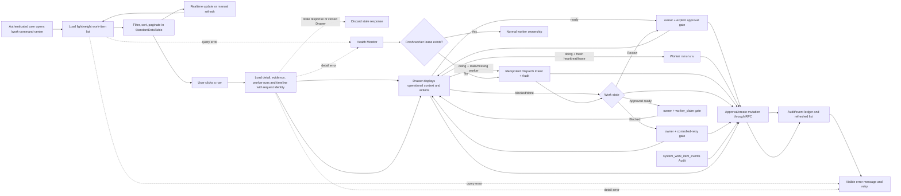
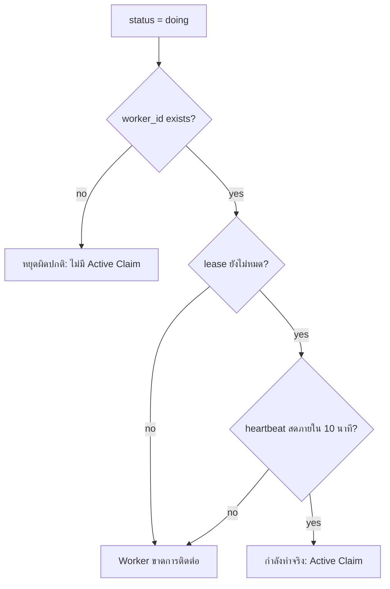

# Work Command Center Flow

## Purpose

The Work Command Center is the authenticated operational queue for creating,
reviewing, approving, and monitoring `system_work_items`. The list view is a
summary projection; full `detail` and `evidence` are fetched only when a user
opens a row so the initial page remains responsive without hiding information.
Worker outcome is derived from real `system_work_items` lease/heartbeat fields
and the Drawer reads recent `system_worker_runs`; no status is fabricated and
the UI does not change business data.

## Inputs and outputs

- **Inputs:** authenticated company context, `system_work_items`,
  `system_worker_runs`, realtime changes, and explicit user actions.
- **List output:** status counts, a paginated table of current work-item
  summaries, and a readable Worker outcome.
- **Detail output:** full detail/evidence, worker lease state, recent worker
  runs, and the latest 100 audit events for the selected work key.
- **Mutation output:** existing RPC result, refreshed list, and audit/event
  record; this worker-progress UI adds no new mutation.
  `system_work_dispatch_intents`, realtime changes, Health Monitor, and explicit
  user actions.
- **List output:** status counts and a paginated table of current work-item
  summaries.
- **Detail output:** full detail/evidence, worker lease state, the current
  Dispatch Intent (owner, next gate, next action, SLA), and the latest 100 audit
  events for the selected work key.
- **Mutation output:** RPC result, refreshed list, and audit/event record.

## States, roles, and safety

The table reflects `ready`, `doing`, `review`, `blocked`, and `done`. A
`ready` item is acknowledged and waiting for a Worker. A `doing` item is
active only while it has a Worker, a valid lease, and a heartbeat less than ten
minutes old; otherwise it is labelled as no Worker result and directs the user
to inspect the run/recovery path before retrying. `blocked` and `done` remain
their recorded outcomes.

Company context and existing RLS/RPC permissions remain authoritative. The UI
never updates `system_work_items` directly; create and approval actions use the
existing RPCs and mutation-attempt audit path. Realtime refresh waits while a
user is selecting text so copied work information is not interrupted.

`owner` is a routing assignment, not proof that a worker is running. A worker
is active only when `worker_id`, an unexpired lease, and a heartbeat within ten
minutes are all present. This reconciles the Active Claim semantics documented
in `docs/SYSTEM_WORK_CLAIM_RECOVERY_FLOW.md` without changing claim or recovery
behavior.

When no `system_worker_runs` row has a fresh heartbeat, Health Monitor records
at most one pending intent for each `(work_key, intent_kind)`. It only records
the owner and required gate. It never starts business work, approves a request,
changes a work-item state, sends a new external notification, or retries a
matching failure automatically. Review requires explicit approval; blocked work
requires root-cause resolution before a controlled retry.

## Active Claim semantics

`กำลังทำจริง` จะแสดงเฉพาะเมื่อมี `worker_id`, `lease_expires_at` ยังไม่หมด
และ `heartbeat_at` สดไม่เกิน 10 นาทีจากเวลาปัจจุบัน การมี `status=doing`
เพียงอย่างเดียวไม่ถือว่าเป็น Active Claim; งานอย่าง `SYS-004` ที่เป็น monitoring
sentinel หรือแถว orphan จะถูกแสดงเป็นหยุดผิดปกติ/ขาดการติดต่อแทน และไม่ถูกนับใน
การ์ด “กำลังทำจริง”.

หน้าจอ recompute `claimNow` ทุก 1 วินาที จึงเปลี่ยนจาก “กำลังทำจริง” เป็น
“Worker ขาดการติดต่อ” หรือ “หยุดผิดปกติ” ได้เองเมื่อเวลาผ่านเส้น lease/heartbeat
แม้ไม่มี realtime event ใหม่; การ refresh ข้อมูลจากฐานข้อมูลยังคงทำตามรอบเดิม.

## Failure, retry, and audit

List/detail query failures stay visible with a retry action. Realtime refreshes
are debounced and repeat the lightweight list query; opening a row performs
separate detail, worker-run, and audit queries. Existing event/audit records
are not changed or discarded. The Work Command Center owner is Platform
Operations.

Each Drawer open receives a monotonic request identity. Only the latest open
may update detail, evidence, timeline, worker runs, loading, or error state;
responses from an earlier row or a closed Drawer are discarded. Detail failures
are shown separately from list errors and can be retried without changing the
selected work item. Successful silent list refreshes clear stale list notices.

Dispatch-intent inserts, updates, and supersessions append a
`system_work_item_events` record. RLS is enabled: authenticated users can only
read intents for visible parent work items, clients have no write permission,
and Health Monitor is the only writer.

## Change record

- Version: v1.1
- Date: 2026-09-07
- Rationale: reduce `/work-command-center` LCP by removing large detail/evidence
  fields from the initial list payload while preserving on-demand inspection.
- Migration: none.
- Rollback: revert the UI commit; database records and audit history are
  unaffected.

- Version: v1.2
- Date: 2026-09-07
- Rationale: prevent stale Drawer responses and make detail recovery explicit.
- Migration: none.
- Rollback: revert the UI/test/doc commit; database records and audit history
  are unaffected.

- Version: v1.3
- Date: 2026-09-07
- Rationale: distinguish the persisted `doing` state from a live worker claim so
  stale/orphan rows cannot be presented as actively running.
- Verification: targeted Work Command Center test, typecheck, lint, build and
  read-only query of `worker_id`, `heartbeat_at`, `lease_expires_at` and
  `system_worker_runs`.
- Migration: none. No work item or business data is changed by the UI.
- Rollback: revert the UI/test/doc commit; claim and audit history remain intact.

- Version: v1.4
- Date: 2026-09-07
- Rationale: recompute time-based claim expiry without waiting for a database or
  realtime event.
- Verification: fake-clock tests at the fresh-heartbeat, stale-heartbeat and
  lease-expiry boundaries, plus typecheck, lint and build.
- Migration: none. No work item or business data is changed by the timer.
- Rollback: revert the UI/helper/test/doc commit; claim and audit history remain intact.
- Rationale: make Worker acknowledgement, active execution, stale/no-output,
  blocked, and completed outcomes visible from the real queue and run records.
- Impact: read-only Worker progress/status UI, recent run evidence in the
  Drawer, and a Flow Registry entry; no schema, RLS, RPC, business record, or
  deployment change.
- Verification: targeted Worker progress and Work Command contracts,
  responsive contract, typecheck, lint, build, then authenticated runtime smoke
  after release.
- Rollback: revert the UI/docs/test commit; queue, lease, run, and audit data
  remain unchanged.

- Version: v1.4
- Date: 2026-09-08
- Rationale: share the Active Claim predicate with the Worker Progress UI so a
  live lease or heartbeat expiry cannot leave the command center showing a
  worker as active.
- Impact: the active count, active tab, status chip, and Worker outcome refresh
  once per second from existing read-only queue fields; no role, RLS, RPC,
  schema, or business-data mutation changes.
- Verification: deterministic fake-clock claim tests, Worker progress and Work
  Command contracts, typecheck, lint, build, then authenticated runtime smoke.
- Rollback: revert the shared helper and UI integration; queue, lease, run, and
  audit records remain unchanged.
- Rationale: make stalled approvals and blank worker completions recoverable
  without allowing a user or worker to bypass the approved scope.
- Migration: `20260907130000_control_plane_stall_recovery.sql`.
- Operational path: ready -> submit for review -> one approval record ->
  approved ready -> atomic claim -> claimed outcome -> completed, blocked, or
  no_output outcome. A manager can reconcile only an approved, fingerprint-
  matching, lease-free item; retry counts are retained and capped items still
  require the explicit retry-reset path.
- Verification: targeted contract test, typecheck, lint, build, migration CI,
  and authenticated Drawer smoke after release.
- Rollback: revert the source change in a corrective PR. Retain worker
  outcomes and audit records; do not delete or rewrite prior work history.
- Date: 2026-09-09
- Rationale: eliminate silent Zero-Active periods by making the next owner,
  gate, action, and SLA visible and durable when no worker has a fresh lease.
- Migration: `20260909114055_work_command_center_continuous_dispatch.sql`.
- Verification: contract tests cover idempotent dispatch intent, zero-active
  worker detection, approval/retry gates, audit, RLS, typecheck, lint, and build.
- Rollback: revert the Health Monitor/UI change and stop creating new intents.
  Existing work items and audit records remain untouched.
