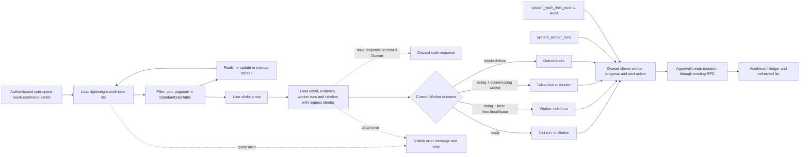

# Work Command Center Flow

## Purpose

The Work Command Center is the authenticated operational queue for creating,
reviewing, approving, and monitoring `system_work_items`. The list view is a
summary projection; full `detail` and `evidence` are fetched only when a user
opens a row so the initial page remains responsive without hiding information.
Worker outcome is derived from real `system_work_items` lease/heartbeat fields
and the Drawer reads recent `system_worker_runs`; no status is fabricated and
the UI does not change business data.

## Inputs and outputs

- **Inputs:** authenticated company context, `system_work_items`,
  `system_worker_runs`, realtime changes, and explicit user actions.
- **List output:** status counts, a paginated table of current work-item
  summaries, and a readable Worker outcome.
- **Detail output:** full detail/evidence, worker lease state, recent worker
  runs, and the latest 100 audit events for the selected work key.
- **Mutation output:** existing RPC result, refreshed list, and audit/event
  record; this worker-progress UI adds no new mutation.

## States, roles, and safety

The table reflects `ready`, `doing`, `review`, `blocked`, and `done`. A
`ready` item is acknowledged and waiting for a Worker. A `doing` item is
active only while it has a Worker, a valid lease, and a heartbeat less than ten
minutes old; otherwise it is labelled as no Worker result and directs the user
to inspect the run/recovery path before retrying. `blocked` and `done` remain
their recorded outcomes.

Company context and existing RLS/RPC permissions remain authoritative. The UI
never updates `system_work_items` directly; create and approval actions use the
existing RPCs and mutation-attempt audit path. Realtime refresh waits while a
user is selecting text so copied work information is not interrupted.

## Failure, retry, and audit

List/detail query failures stay visible with a retry action. Realtime refreshes
are debounced and repeat the lightweight list query; opening a row performs
separate detail, worker-run, and audit queries. Existing event/audit records
are not changed or discarded. The Work Command Center owner is Platform
Operations.

Each Drawer open receives a monotonic request identity. Only the latest open
may update detail, evidence, timeline, worker runs, loading, or error state;
responses from an earlier row or a closed Drawer are discarded. Detail failures
are shown separately from list errors and can be retried without changing the
selected work item. Successful silent list refreshes clear stale list notices.

## Change record

- Version: v1.1
- Date: 2026-09-07
- Rationale: reduce `/work-command-center` LCP by removing large detail/evidence
  fields from the initial list payload while preserving on-demand inspection.
- Migration: none.
- Rollback: revert the UI commit; database records and audit history are
  unaffected.

- Version: v1.2
- Date: 2026-09-07
- Rationale: prevent stale Drawer responses and make detail recovery explicit.
- Migration: none.
- Rollback: revert the UI/test/doc commit; database records and audit history
  are unaffected.

- Version: v1.3
- Date: 2026-09-07
- Rationale: make Worker acknowledgement, active execution, stale/no-output,
  blocked, and completed outcomes visible from the real queue and run records.
- Impact: read-only Worker progress/status UI, recent run evidence in the
  Drawer, and a Flow Registry entry; no schema, RLS, RPC, business record, or
  deployment change.
- Verification: targeted Worker progress and Work Command contracts,
  responsive contract, typecheck, lint, build, then authenticated runtime smoke
  after release.
- Rollback: revert the UI/docs/test commit; queue, lease, run, and audit data
  remain unchanged.

- Version: v1.4
- Date: 2026-09-08
- Rationale: share the Active Claim predicate with the Worker Progress UI so a
  live lease or heartbeat expiry cannot leave the command center showing a
  worker as active.
- Impact: the active count, active tab, status chip, and Worker outcome refresh
  once per second from existing read-only queue fields; no role, RLS, RPC,
  schema, or business-data mutation changes.
- Verification: deterministic fake-clock claim tests, Worker progress and Work
  Command contracts, typecheck, lint, build, then authenticated runtime smoke.
- Rollback: revert the shared helper and UI integration; queue, lease, run, and
  audit records remain unchanged.
