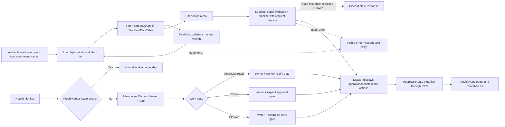

# Work Command Center Flow

## Purpose

The Work Command Center is the authenticated operational queue for creating,
reviewing, approving, and monitoring `system_work_items`. The list view is a
summary projection; full `detail` and `evidence` are fetched only when a user
opens a row so the initial page remains responsive without hiding information.

## Inputs and outputs

- **Inputs:** authenticated company context, `system_work_items`,
  `system_work_dispatch_intents`, realtime changes, Health Monitor, and explicit
  user actions.
- **List output:** status counts and a paginated table of current work-item
  summaries.
- **Detail output:** full detail/evidence, worker lease state, the current
  Dispatch Intent (owner, next gate, next action, SLA), and the latest 100 audit
  events for the selected work key.
- **Mutation output:** RPC result, refreshed list, and audit/event record.

## States, roles, and safety

The table reflects `ready`, `doing`, `review`, `blocked`, and `done`. Company
context and existing RLS/RPC permissions remain authoritative. The UI never
updates `system_work_items` directly; create and approval actions use the
existing RPCs and mutation-attempt audit path.

`owner` is a routing assignment, not proof that a worker is running. A worker
is active only when `worker_id`, an unexpired lease, and a heartbeat within ten
minutes are all present. This reconciles the Active Claim semantics documented
in `docs/SYSTEM_WORK_CLAIM_RECOVERY_FLOW.md` without changing claim or recovery
behavior.

When no `system_worker_runs` row has a fresh heartbeat, Health Monitor records
at most one pending intent for each `(work_key, intent_kind)`. It only records
the owner and required gate. It never starts business work, approves a request,
changes a work-item state, sends a new external notification, or retries a
matching failure automatically. Review requires explicit approval; blocked work
requires root-cause resolution before a controlled retry.

## Failure, retry, and audit

List/detail query failures stay visible with a retry action. Realtime refreshes
are debounced and repeat the lightweight list query; opening a row performs a
separate full-detail query. Existing event/audit records are not changed or
discarded. The Work Command Center owner is Platform Operations.

Each Drawer open receives a monotonic request identity. Only the latest open
may update detail, evidence, timeline, loading, or error state; responses from
an earlier row or a closed Drawer are discarded. Detail failures are shown
separately from list errors and can be retried without changing the selected
work item. Successful silent list refreshes clear stale list notices.

Dispatch-intent inserts, updates, and supersessions append a
`system_work_item_events` record. RLS is enabled: authenticated users can only
read intents for visible parent work items, clients have no write permission,
and Health Monitor is the only writer.

## Change record

- Version: v1.1
- Date: 2026-09-07
- Rationale: reduce `/work-command-center` LCP by removing large detail/evidence
  fields from the initial list payload while preserving on-demand inspection.
- Migration: none.
- Rollback: revert the UI commit; database records and audit history are
  unaffected.

- Version: v1.2
- Date: 2026-09-07
- Rationale: prevent stale Drawer responses and make detail recovery explicit.
- Migration: none.
- Rollback: revert the UI/test/doc commit; database records and audit history
  are unaffected.

- Version: v1.3
- Date: 2026-09-09
- Rationale: eliminate silent Zero-Active periods by making the next owner,
  gate, action, and SLA visible and durable when no worker has a fresh lease.
- Migration: `20260909114055_work_command_center_continuous_dispatch.sql`.
- Verification: contract tests cover idempotent dispatch intent, zero-active
  worker detection, approval/retry gates, audit, RLS, typecheck, lint, and build.
- Rollback: revert the Health Monitor/UI change and stop creating new intents.
  Existing work items and audit records remain untouched.
