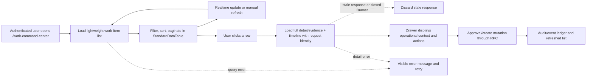

# Work Command Center Flow

## Purpose

The Work Command Center is the authenticated operational queue for creating,
reviewing, approving, and monitoring `system_work_items`. The list view is a
summary projection; full `detail` and `evidence` are fetched only when a user
opens a row so the initial page remains responsive without hiding information.

## Inputs and outputs

- **Inputs:** authenticated company context, `system_work_items`, realtime
  changes, and explicit user actions.
- **List output:** status counts and a paginated table of current work-item
  summaries.
- **Detail output:** full detail/evidence, worker lease state, and the latest
  100 audit events for the selected work key.
- **Mutation output:** RPC result, refreshed list, and audit/event record.

## States, roles, and safety

The table reflects `ready`, `doing`, `review`, `blocked`, and `done`. Company
context and existing RLS/RPC permissions remain authoritative. The UI never
updates `system_work_items` directly; create and approval actions use the
existing RPCs and mutation-attempt audit path.

## Failure, retry, and audit

List/detail query failures stay visible with a retry action. Realtime refreshes
are debounced and repeat the lightweight list query; opening a row performs a
separate full-detail query. Existing event/audit records are not changed or
discarded. The Work Command Center owner is Platform Operations.

Each Drawer open receives a monotonic request identity. Only the latest open
may update detail, evidence, timeline, loading, or error state; responses from
an earlier row or a closed Drawer are discarded. Detail failures are shown
separately from list errors and can be retried without changing the selected
work item. Successful silent list refreshes clear stale list notices.

## Change record

- Version: v1.1
- Date: 2026-09-07
- Rationale: reduce `/work-command-center` LCP by removing large detail/evidence
  fields from the initial list payload while preserving on-demand inspection.
- Migration: none.
- Rollback: revert the UI commit; database records and audit history are
  unaffected.

- Version: v1.2
- Date: 2026-09-07
- Rationale: prevent stale Drawer responses and make detail recovery explicit.
- Migration: none.
- Rollback: revert the UI/test/doc commit; database records and audit history
  are unaffected.

- Version: v1.3
- Date: 2026-09-07
- Rationale: make stalled approvals and blank worker completions recoverable
  without allowing a user or worker to bypass the approved scope.
- Migration: `20260907130000_control_plane_stall_recovery.sql`.
- Operational path: ready -> submit for review -> one approval record ->
  approved ready -> atomic claim -> claimed outcome -> completed, blocked, or
  no_output outcome. A manager can reconcile only an approved, fingerprint-
  matching, lease-free item; retry counts are retained and capped items still
  require the explicit retry-reset path.
- Verification: targeted contract test, typecheck, lint, build, migration CI,
  and authenticated Drawer smoke after release.
- Rollback: revert the source change in a corrective PR. Retain worker
  outcomes and audit records; do not delete or rewrite prior work history.
