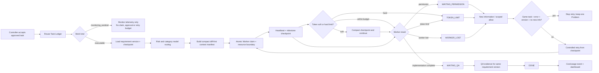

# Work Control Core Flow

## Purpose

The existing `system_work_items` ledger remains the task source of truth. V2 keeps the V1 checkpoint and anti-loop path, then adds fail-open model routing, per-task token budgets, prompt/schema versioning, exact-input result-cache storage, QA tier, resource-lock storage and idempotent cost telemetry. Missing optional routing configuration keeps the current model and never blocks an otherwise valid task.

`monitoring_sentinel` rows share the visible ledger but are not executable work. They never enter claim, approval, retry, token or Worker-capacity calculations. Monitor telemetry is stored in dedicated fields so a scheduled check cannot overwrite Controller evidence or checkpoints.

## Inputs and outputs

- Input: approved work item, category/risk, requirement version, existing checkpoint, context manifest, approval fingerprint and Worker capability.
- Worker packet: task identity, scope, requirement version, checkpoint, evidence reference and only the files/policies named by the manifest.
- Output: structured outcome, current step, checkpoint, evidence, problem category, new-information hash, model/QA route, token counts, cost and cache result.
- The flow reuses the existing Task, Run, Event, Approval and Dispatch ledgers. It does not create a second task queue.

## States and roles

`queued`, `active`, `blocked`, `paused`, `waiting_permission`, `token_limit`, `waiting_qa`, `worker_lost`, and `done` describe the control state while the existing task status remains compatible with current screens and integrations.

Controller owns scope, routing and problem resolution. Execution Worker owns implementation. QA owner verifies the same requirement version. Admin/Jong remains the owner of business and high-risk decisions.

Routing defaults are economy for low-risk operations/report/audit, reasoning for critical or tenant/security/migration work, and balanced otherwise. A company/category/risk policy may override those defaults. An empty `model_name` deliberately preserves the runner's current model; configured environment mappings may select a concrete model without changing task scope.

## Failure, retry and recovery

Every finish persists a checkpoint before releasing the claim. A stale heartbeat becomes `worker_lost` and blocks automatic retry. A repeated `(work_key, requirement_version, error_fingerprint)` updates one Problem row. Retry is available only after a different non-empty new-information hash is recorded. Token or permission stops preserve the same checkpoint. Cost events are unique per run so a repeated terminal callback cannot double-count. Telemetry failure is reported separately and never turns an already-completed mutation into a retry.

## Audit, security and owner

Checkpoint and Problem tables are tenant-readable only through the visible parent task and client writes are revoked. Service-role Worker RPCs write the control records. Existing approval fingerprint, bounded attempt count and audit events remain in force. Platform Operations owns this flow.

Cache reuse is permitted only for an exact key composed from requirement/source/prompt/schema/dependency identity; stale or ambiguous entries are not eligible. Resource locks are lease-bound and additive; the V2 rollout does not weaken the existing atomic claim. Cost and routing configuration are visible through existing tenant-scoped Work Command Center access, while browser clients cannot mutate the control tables.

## Change record

| Version | Date | Rationale | Impact | Migration | Verification | Rollback |
|---|---|---|---|---|---|---|
| v1.0 | 2026-09-16 | Stop lost work, full-chat reload and same-error retry loops | Extends existing work/run ledgers; compact Worker packet and explicit recovery states | `202609160001_work_control_core_p0.sql` | state-transition contracts, migration safety, typecheck, lint, build and authenticated Work Command Center smoke | Revert source/UI and stop using v2 RPCs; additive columns/tables and audit/checkpoints remain for recovery |
| v2.0 | 2026-09-16 | Reduce token/cost while preserving throughput and recovery | Adds fail-open routing/budgets, QA tier, versioned output, exact cache/lock foundations, idempotent cost events and UI visibility | `202609160002_work_control_core_v2_cost_routing.sql` | V1+V2 contracts, PowerShell parse, migration safety, typecheck, lint, build and authenticated Work Command Center smoke | Revert runner/Edge/UI to V1; retain additive telemetry/config tables for audit, disable policies and model env mappings |
| v2.1 | 2026-09-16 | Remove stale queue noise after verified releases without deleting history | Reconciles implementation/QA children to merged PRs, completes their pending intents, restores SYS-004 sentinel semantics and keeps zero-runner capacity open | `202609160003_reconcile_work_queue_after_control_v2.sql` | guarded migration contract, full replay/dry-run, before/after queue counts and authenticated Work Command Center smoke | restore affected rows from append-only event history; do not delete reconciliation events |
| v2.2 | 2026-09-16 | Prevent monitoring telemetry from corrupting Worker/Approval metrics | Adds formal `monitoring_sentinel` kind, dedicated monitor fields, claim exclusion and truthful unknown-token UI | `202609160004_sys004_monitoring_sentinel_hardening.sql` | sentinel/claim/API/UI contracts, migration replay/dry-run, typecheck, lint, build and authenticated Work Command Center smoke | revert source/UI and stop writing new monitor fields; retain additive columns and audit event for recovery |
| v2.3 | 2026-09-16 | Make zero-active reporting reflect claim eligibility instead of all intents | Distinguishes approved dispatch work from approval/unblock management work and reconciles the two superseded SYS-004 repair children | `202609160005_reconcile_sys004_resolved_children.sql` | runner no-op smoke, queue/UI contracts, replay/dry-run, typecheck, lint, build and authenticated page smoke | revert UI; recover the two child rows from append-only events without changing SYS-004 monitor state |
