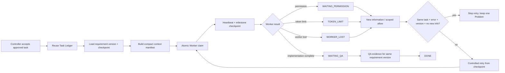

# Work Control Core Flow

## Purpose

The existing `system_work_items` ledger remains the task source of truth. P0 adds durable checkpoints, compact context, explicit control states, and a versioned Problem record so a worker can stop and resume without loading full chat history or repeating the same failure.

## Inputs and outputs

- Input: approved work item, requirement version, existing checkpoint, context manifest, approval fingerprint and Worker capability.
- Worker packet: task identity, scope, requirement version, checkpoint, evidence reference and only the files/policies named by the manifest.
- Output: structured outcome, current step, checkpoint, evidence, problem category, new-information hash and token counts when available.
- The flow reuses the existing Task, Run, Event, Approval and Dispatch ledgers. It does not create a second task queue.

## States and roles

`queued`, `active`, `blocked`, `paused`, `waiting_permission`, `token_limit`, `waiting_qa`, `worker_lost`, and `done` describe the control state while the existing task status remains compatible with current screens and integrations.

Controller owns scope, routing and problem resolution. Execution Worker owns implementation. QA owner verifies the same requirement version. Admin/Jong remains the owner of business and high-risk decisions.

## Failure, retry and recovery

Every finish persists a checkpoint before releasing the claim. A stale heartbeat becomes `worker_lost` and blocks automatic retry. A repeated `(work_key, requirement_version, error_fingerprint)` updates one Problem row. Retry is available only after a different non-empty new-information hash is recorded. Token or permission stops preserve the same checkpoint.

## Audit, security and owner

Checkpoint and Problem tables are tenant-readable only through the visible parent task and client writes are revoked. Service-role Worker RPCs write the control records. Existing approval fingerprint, bounded attempt count and audit events remain in force. Platform Operations owns this flow.

## Change record

| Version | Date | Rationale | Impact | Migration | Verification | Rollback |
|---|---|---|---|---|---|---|
| v1.0 | 2026-09-16 | Stop lost work, full-chat reload and same-error retry loops | Extends existing work/run ledgers; compact Worker packet and explicit recovery states | `202609160001_work_control_core_p0.sql` | state-transition contracts, migration safety, typecheck, lint, build and authenticated Work Command Center smoke | Revert source/UI and stop using v2 RPCs; additive columns/tables and audit/checkpoints remain for recovery |
